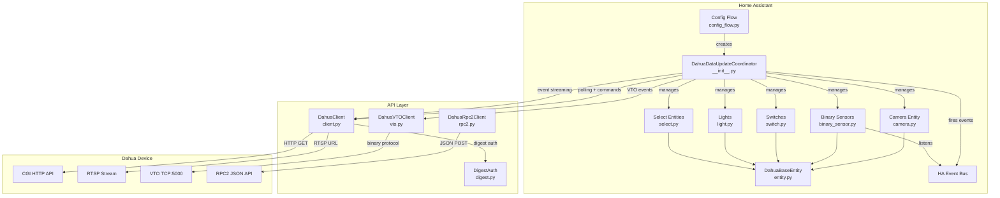

# Architecture

## System Architecture

## Design Patterns

### Coordinator Pattern
The integration uses Home Assistant's `DataUpdateCoordinator` pattern. `DahuaDataUpdateCoordinator` is the central hub that:
1. Initializes device capabilities on first refresh (feature detection)
2. Polls device state every 30 seconds via `_async_update_data`
3. Manages persistent event stream connections (IP cameras and VTO doorbells)
4. Stores event timestamps for binary sensor state
5. Provides capability-check methods consumed by entities

### Feature Detection
During initialization, the coordinator probes the device to determine supported features:
- Coaxial control (speaker/white light)
- Disarming linkage
- Smart motion detection
- PTZ position
- Lighting (IR and V2)
- Profile modes
- Floodlight mode

Each probe wraps the API call in a try/except — if the call fails, the feature is marked unsupported.

### Dual Event Streaming
Two separate event streaming mechanisms exist:
1. **IP Camera events**: HTTP long-polling via `eventManager.cgi?action=attach` — parsed from `--myboundary`-delimited text with `Code=X;action=Y;index=Z;data={...}` format
2. **VTO/Doorbell events**: Binary TCP protocol on port 5000 using `asyncio.Protocol` — JSON messages wrapped in a 32-byte binary header (DHIP protocol)

Both streams fire events on the HA event bus as `dahua_event_received`.

### Entity Hierarchy
All entities inherit from `DahuaBaseEntity` → `CoordinatorEntity`, which provides:
- Device info (model, serial, firmware, manufacturer)
- Unique ID based on serial number
- Automatic state updates from coordinator data

### API Communication
- **Primary**: `DahuaClient` uses HTTP GET with Digest Auth to Dahua CGI endpoints
- **Alternative**: `DahuaRpc2Client` uses HTTP POST with JSON-RPC to `/RPC2` endpoint
- **VTO**: `DahuaVTOClient` uses a custom binary TCP protocol with MD5 challenge-response auth

### Channel Handling
The integration supports multi-channel devices (NVRs). Channel index is 0-based, but channel number is 1-based (index + 1). Some older firmwares use the same value for both — the coordinator detects this during initialization by attempting a snapshot with channel 0.
