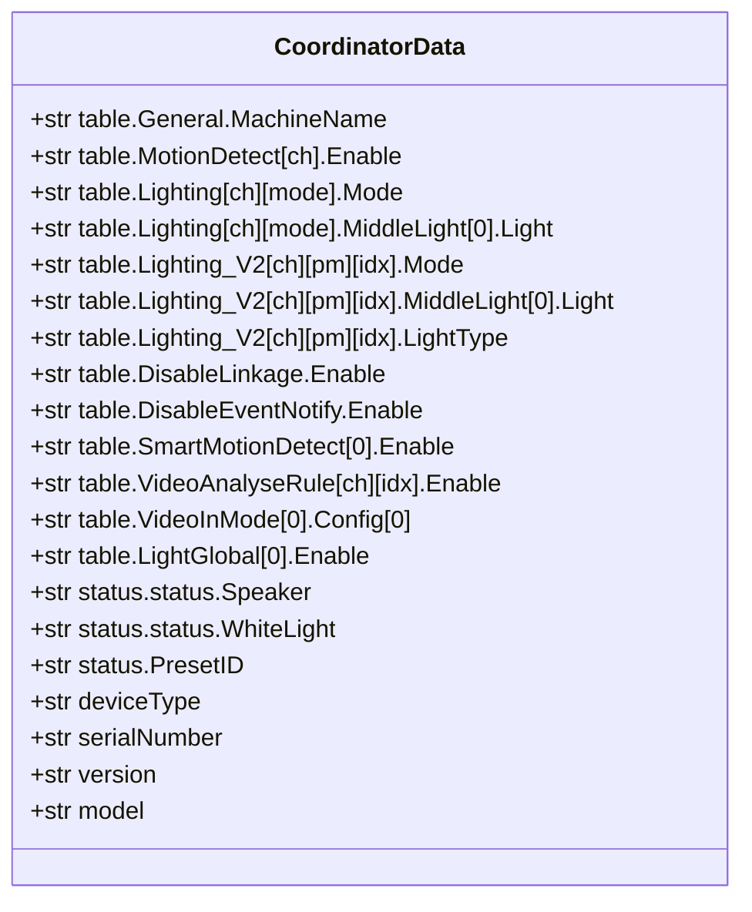
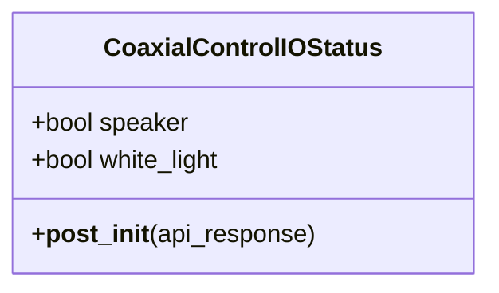

# Data Models

## Core Data Structures

### Coordinator State (`DahuaDataUpdateCoordinator.data`)

The coordinator's `data` dict is a flat key-value store populated from Dahua API responses. Keys follow the Dahua API naming convention.



All values are strings. Boolean checks compare against `"true"` / `"false"` (case-insensitive).

### CoaxialControlIOStatus (`models.py`)



Dataclass parsing RPC2 API response for speaker and white light status.

### Event Data Structures

#### IP Camera Event (parsed from HTTP stream)

```python
{
    "Code": "VideoMotion",       # Event type
    "action": "Start",           # Start, Stop
    "index": "0",                # Channel index
    "data": {                    # Optional JSON payload
        "Id": [0],
        "RegionName": ["Region1"],
        "SmartMotionEnable": False
    },
    "name": "Cam13",             # Added by coordinator
    "DeviceName": "Cam13"        # Added by coordinator
}
```

#### VTO Event (from binary protocol)

```python
{
    "Code": "BackKeyLight",
    "Action": "Pulse",           # Note: capitalized vs IP camera
    "Data": {
        "LocaleTime": "2021-06-20 13:52:20",
        "State": 1,
        "UTC": 1624168340.0
    },
    "Index": -1,
    "DeviceName": "Doorbell"     # Added by coordinator
}
```

Note: VTO events use capitalized keys (`Action`, `Data`, `Index`) while IP camera events use lowercase (`action`, `data`, `index`).

### Event Timestamp Registry

```python
# Key: "{event_name}-{channel}" → Value: epoch seconds (active) or 0 (cleared)
_dahua_event_timestamp: Dict[str, int] = {
    "VideoMotion-0": 1624168340,      # Active
    "CrossLineDetection-0": 0,         # Cleared
}
```

### Config Entry Data

```python
{
    "username": str,
    "password": str,
    "address": str,       # IP address or hostname
    "port": str,          # HTTP port (default "80")
    "rtsp_port": str,     # RTSP port (default "554")
    "channel": int,       # 0-based channel index
    "name": str,          # User-assigned device name
    "events": list[str],  # Selected event codes
}
```

### Dahua API Response Format

Dahua CGI APIs return plain text with `key=value` pairs, one per line:

```
table.MotionDetect[0].Enable=true
table.MotionDetect[0].DetectVersion=V3.0
```

Parsed by `DahuaClient.parse_dahua_api_response()` into a flat dict.

### DHIP Binary Protocol Frame

```
Bytes 0-3:   Magic (0x20000000)
Bytes 4-7:   Protocol ID (0x44484950 = "DHIP")
Bytes 8-15:  Reserved (0)
Bytes 16-19: Payload length (little-endian)
Bytes 20-23: Reserved (0)
Bytes 24-27: Payload length (little-endian, repeated)
Bytes 28-31: Reserved (0)
Bytes 32+:   JSON payload (UTF-8)
```
