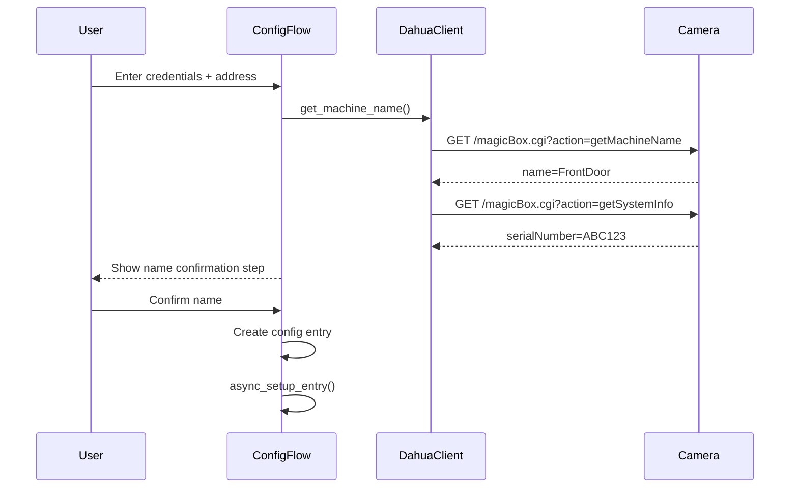
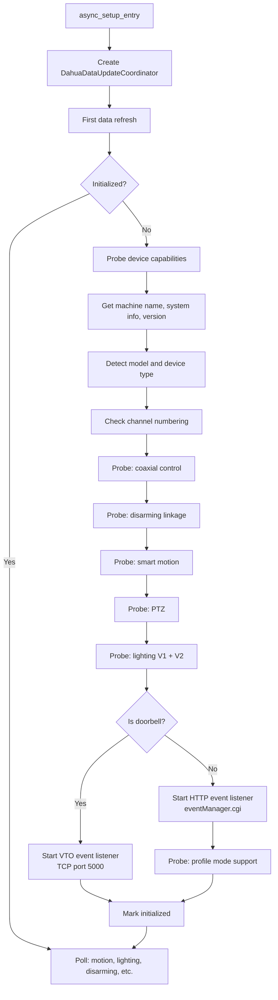
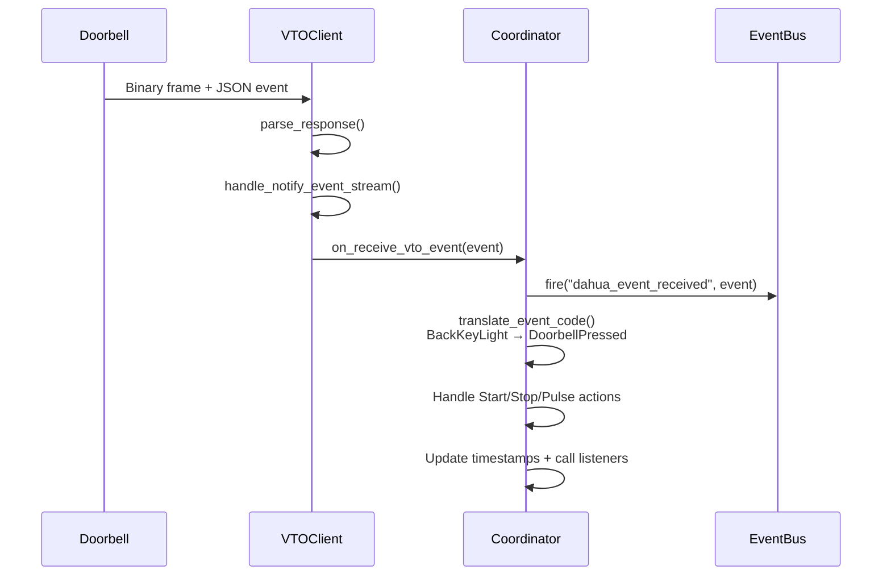
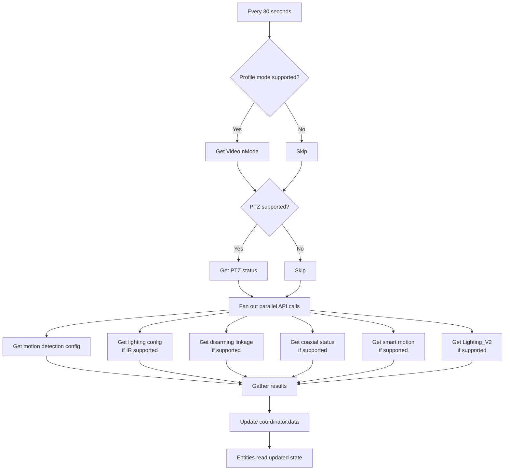
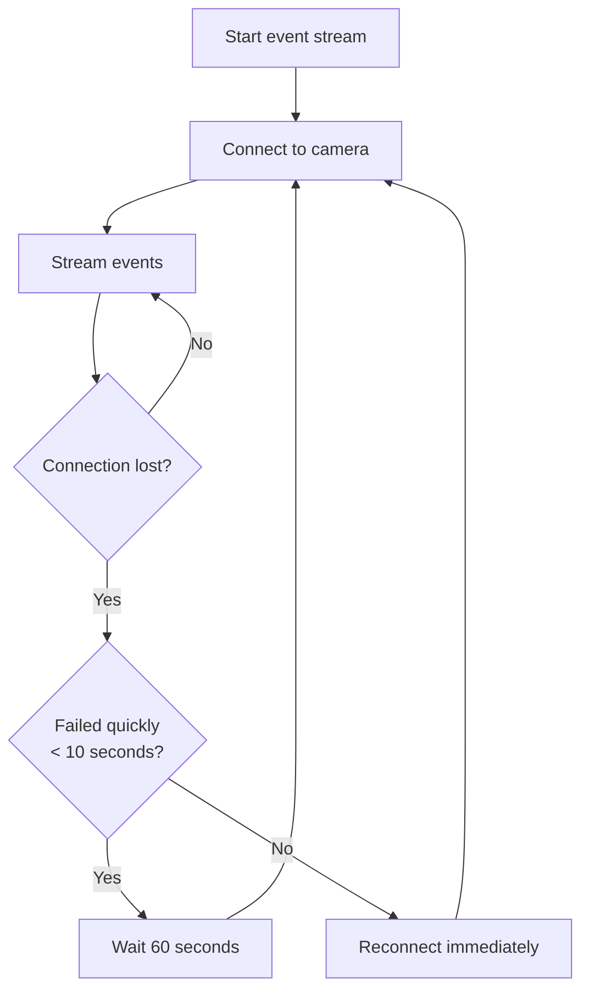
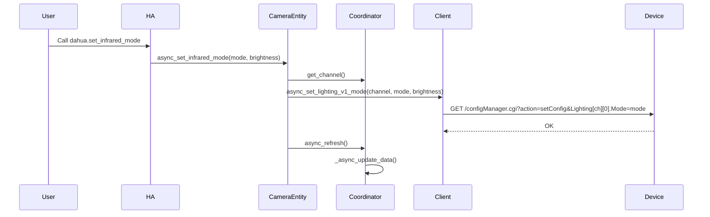

# Workflows

## Integration Setup Flow



## Device Initialization



## Event Processing (IP Camera)

```mermaid
sequenceDiagram
    participant Camera
    participant Client
    participant Coordinator
    participant EventBus
    participant BinarySensor

    Camera->>Client: HTTP chunked response<br/>Code=VideoMotion;action=Start;index=0;data={...}
    Client->>Coordinator: on_receive(data_bytes, channel)
    Coordinator->>Coordinator: parse_event(data)
    Coordinator->>Coordinator: Filter by channel
    Coordinator->>Coordinator: translate_event_code()
    Coordinator->>EventBus: fire("dahua_event_received", event)
    Coordinator->>Coordinator: Update _dahua_event_timestamp
    Coordinator->>BinarySensor: Call registered listener
    BinarySensor->>BinarySensor: schedule_update_ha_state()
```

## Event Processing (VTO Doorbell)



## Periodic State Polling



## Event Stream Reconnection



VTO reconnection uses a simpler 5s delay on disconnect, 30s on connection failure.

## Service Call Flow


