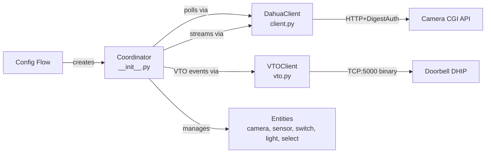

# AGENTS.md — Dahua Home Assistant Integration

<!-- tags: ai-context, codebase-navigation, dahua, home-assistant, custom-integration -->

Custom Home Assistant integration for Dahua IP cameras, doorbells (VTO), NVRs, and DVRs. Also supports Amcrest, Lorex, IMOU, EmpireTech, and Avaloid Goliath rebranded devices. Version 0.9.81, HACS-installable.

## Table of Contents

- [Directory Map](#directory-map) — Where to find things
- [Architecture Overview](#architecture-overview) — How the system fits together
- [Key Entry Points](#key-entry-points) — Where to start reading
- [Device-Specific Branching](#device-specific-branching) — Model detection patterns
- [Event System](#event-system) — Dual event streaming architecture
- [API Layer](#api-layer) — Three distinct API clients
- [Config and CI](#config-and-ci) — Tooling discoverable from config files
- [Known Quirks](#known-quirks) — Non-obvious behaviors
- [Detailed Documentation](#detailed-documentation) — Deep-dive reference files
- [Custom Instructions](#custom-instructions) — Human/agent-maintained conventions

## Directory Map

<!-- tags: navigation, directory-structure -->

```
custom_components/dahua/
├── __init__.py          # Coordinator (central hub): setup, polling, event streams, feature detection
├── client.py            # HTTP API client: all CGI endpoint calls, Digest Auth, RTSP URLs
├── camera.py            # Camera entity + 18 service registrations (infrared, overlays, IVS, PTZ, reboot)
├── binary_sensor.py     # Event-driven binary sensors (motion, tripwire, doorbell press)
├── switch.py            # Toggles: motion detection, siren, smart motion, disarming
├── light.py             # IR light, illuminator, flood light, security light, ring light
├── select.py            # Dropdowns: doorbell light mode, PTZ preset position
├── config_flow.py       # UI setup flow: credentials → name → config entry
├── entity.py            # Base entity: device info, unique ID from serial number
├── vto.py               # VTO doorbell binary TCP client (port 5000, DHIP protocol)
├── rpc2.py              # Alternative RPC2 JSON API client (currently unused by main flow)
├── digest.py            # Custom aiohttp Digest Auth (aiohttp lacks native support)
├── dahua_utils.py       # Brightness conversion, event stream text parser
├── const.py             # Domain, platform list, config keys, icons
├── models.py            # CoaxialControlIOStatus dataclass (used by rpc2.py only)
├── services.yaml        # HA service definitions for all 18 camera services
└── translations/        # UI strings: en, es, fr, it, bg, ca, nl, pt, pt-BR
```

Other directories: `tests/` (minimal), `scripts/` (develop, lint, setup), `.github/workflows/` (CI).

## Architecture Overview

<!-- tags: architecture, design-patterns -->



**Coordinator pattern**: `DahuaDataUpdateCoordinator` (extends HA's `DataUpdateCoordinator`) is the single source of truth. It initializes by probing device capabilities, polls state every 30s, and maintains persistent event stream connections.

**Entity hierarchy**: All entities extend `DahuaBaseEntity` → `CoordinatorEntity`. Device info (model, serial, firmware) comes from the coordinator.

## Key Entry Points

<!-- tags: entry-points, getting-started -->

| Task | Start Here |
|------|-----------|
| Understand the integration | `__init__.py` → `DahuaDataUpdateCoordinator` |
| Add a new API call | `client.py` → `DahuaClient` |
| Add a new entity | Create in appropriate platform file, register in `__init__.py` PLATFORMS |
| Add a new service | `camera.py` → `async_setup_entry()` service registrations + `services.yaml` |
| Add a new event type | `config_flow.py` → `ALL_EVENTS` list |
| Modify VTO/doorbell behavior | `vto.py` → `DahuaVTOClient` |
| Change feature detection | `__init__.py` → `_async_update_data()` initialization block |

## Device-Specific Branching

<!-- tags: device-detection, model-checks -->

The coordinator uses model string matching to determine device capabilities. Key methods:

| Method | Detection Logic |
|--------|----------------|
| `is_doorbell()` | Model starts with VTO, DH-VTO, DHI, AD, DB6, DB2X, AV-V |
| `is_amcrest_doorbell()` | Model starts with AD or DB6 |
| `supports_siren()` | Model contains -AS-PV, L46N, or starts with W452ASD |
| `supports_security_light()` | Model contains -AS-PV, or is AD410, DB61i, IP8M-2796E |
| `is_flood_light()` | Model starts with ASH26, V261LC, W452ASD, or contains L26N, L46N |
| `supports_infrared_light()` | Lighting supported AND model doesn't contain -AS-PV, -AS-NI, LED-S2 |

Adding support for a new device model typically means updating these string checks.

## Event System

<!-- tags: events, event-streaming -->

Two parallel event streaming mechanisms:

1. **IP cameras**: HTTP long-poll to `eventManager.cgi?action=attach`. Response is `--myboundary`-delimited text: `Code=X;action=Y;index=Z;data={json}`. Parsed by `dahua_utils.parse_event()`.

2. **VTO doorbells**: Binary TCP on port 5000. DHIP protocol (32-byte header + JSON). Handled by `DahuaVTOClient` (asyncio.Protocol).

**Event translation**: `BackKeyLight`/`PhoneCallDetect` → `DoorbellPressed`. `CrossLineDetection` with `ObjectType=human` → also fires `SmartMotionHuman`.

**Reconnection**: IP camera streams retry after 60s if connection fails quickly (<10s), otherwise reconnect immediately. VTO retries after 5s on disconnect, 30s on connection failure.

All events fire on HA event bus as `dahua_event_received`.

## API Layer

<!-- tags: api, http, protocols -->

Three API clients exist (only two are actively used):

| Client | Protocol | Used For |
|--------|----------|----------|
| `DahuaClient` | HTTP GET + Digest Auth | All camera control and polling (primary) |
| `DahuaVTOClient` | TCP binary (DHIP) | Doorbell event streaming |
| `DahuaRpc2Client` | HTTP POST JSON-RPC | Currently unused in main flow |

API responses are `key=value` text parsed into flat dicts. All values are strings — boolean checks compare against `"true"`/`"false"`.

**Channel numbering quirk**: Channel index is 0-based, channel number is index+1. Some older firmwares use the same value for both. The coordinator auto-detects this during init by attempting a snapshot with channel 0.

## Config and CI

<!-- tags: ci, tooling, configuration -->

- **CI** (`.github/workflows/`): HACS validation, Hassfest validation, Black formatting check, pytest on push/PR
- **Linting**: flake8 config in `setup.cfg`, Black for formatting, isort for imports
- **Testing**: `pytest-homeassistant-custom-component` — test coverage is currently minimal
- **HACS**: `hacs.json` requires HACS >=1.6.0, HA >=2025.1.2
- **Dev environment**: VS Code devcontainer (`.devcontainer.json`), scripts in `scripts/`

## Known Quirks

<!-- tags: gotchas, quirks -->

- `supports_ptz_position()` method has a **copy-paste bug** — it checks Lighting_V2 data instead of PTZ data. The `_supports_ptz_position` flag is correct but the public method doesn't use it.
- `button.py` is in PLATFORMS but has no implementation (empty `async_setup_entry`).
- `rpc2.py` and `models.py` are defined but not used in the main integration flow.
- SSL certificate verification is disabled in both `__init__.py` and `config_flow.py` (self-signed certs on cameras).
- VTO events use capitalized keys (`Action`, `Data`) while IP camera events use lowercase (`action`, `data`).
- The siren auto-turns off after 10-15 seconds (hardware behavior, not a bug).

## Detailed Documentation

For deep-dive reference, see `.agents/summary/`:

| File | Contents |
|------|----------|
| `index.md` | Documentation index with query routing guide |
| `architecture.md` | System design, patterns, component diagrams |
| `components.md` | Detailed module-by-module descriptions |
| `interfaces.md` | Complete API reference (CGI, VTO, RPC2, services) |
| `data_models.md` | Data structures, event payloads, protocol framing |
| `workflows.md` | Sequence diagrams for setup, events, polling, services |
| `dependencies.md` | All dependencies and external services |
| `review_notes.md` | Known issues, gaps, and recommendations |

## Custom Instructions

<!-- This section is maintained by developers and agents during day-to-day work.
     It is NOT auto-generated by codebase-summary and MUST be preserved during refreshes.
     Add project-specific conventions, gotchas, and workflow requirements here. -->
