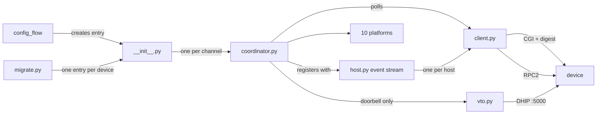

# AGENTS.md — Dahua Home Assistant Integration

<!-- tags: ai-context, codebase-navigation, dahua, home-assistant, custom-integration -->

Custom Home Assistant integration for Dahua IP cameras, doorbells (VTO), indoor
monitors (VTH), NVRs and DVRs. Also supports Amcrest, Lorex, IMOU, EmpireTech and
Avaloid Goliath rebrands. Version 1.1.0, HACS-installable, Home Assistant 2026.8.0
or newer.

**Read `CONTRIBUTING.md` before changing anything.** It is the normative document:
what tests must assert, and the checklists for the things wired in more than one
place. This file is a map, not a rulebook, and where the two disagree
CONTRIBUTING wins.

## Table of Contents

- [Directory Map](#directory-map) — Where to find things
- [Architecture Overview](#architecture-overview) — How the system fits together
- [Key Entry Points](#key-entry-points) — Where to start reading
- [Capability Detection](#capability-detection) — How a feature is decided
- [Event System](#event-system) — Three event transports
- [API Layer](#api-layer) — Five clients
- [Config and CI](#config-and-ci) — Tooling discoverable from config files
- [Known Quirks](#known-quirks) — Non-obvious behaviours
- [Custom Instructions](#custom-instructions) — Human/agent-maintained conventions

## Directory Map

<!-- tags: navigation, directory-structure -->

36 modules, about 22,500 lines.

```
custom_components/dahua/
├── __init__.py             # Config entry lifecycle: setup, unload, remove, device
│                           #   removal, repair cards. Re-exports host.py and
│                           #   coordinator.py names, which are public API for the
│                           #   platforms and the test suite
├── host.py                 # Everything keyed by ADDRESS rather than by entry: the
│                           #   shared TCP connector, failure counts and repair
│                           #   issues, the one event stream per host, the channel
│                           #   numbering probe, the network identity cache
├── coordinator.py          # DahuaDataUpdateCoordinator, one per CHANNEL, plus the
│                           #   pure "what did the device mean" helpers above it
├── client.py               # CGI client: shared read cache, shared RPC2 session,
│                           #   shared digest state, event stream attach, RPC2 event
│                           #   poll, snapshot repair
├── rpc2.py                 # RPC2 JSON-RPC client (login, get/setConfig, PTZ,
│                           #   mediaFileFind, accessControl, VideoTalkPhone)
├── vto.py                  # DHIP on port 5000, held open for doorbell events
├── dhip.py                 # One-shot DHIP: log in, ask, log out. For the add flow
├── discovery.py            # DHDiscover on UDP 37810. No credentials
├── digest.py               # Digest and Basic auth for aiohttp
├── config_flow.py          # Add, DHCP discovery, reauth, reconfigure, options, and
│                           #   the per-channel subentry flow
├── migrate.py              # Merges per-channel entries into one entry per device
├── repairs.py              # Repair flows: switch to HTTPS, remove leftover entries
├── diagnostics.py          # The dump. Talks to no device; reports held state only
├── media_source.py         # Browse and play the recorder's clips
├── flow_preview.py         # Serves one snapshot to the add dialog
├── illuminator_restore.py  # Persistent stores for lighting overrides
├── white_light_override.py # Pure table builders for the channel-scoped white light
├── infrared.py             # Infrared mode writes, transport routing, refusals
├── refusals.py             # What a device has refused outright, so it is not asked
├── deterrence.py           # ProductDefinition parsers for siren / security light
├── ivs.py                  # Identify IVS rules by their own stable Dahua Id
├── dahua_utils.py          # Parsers: events, plates, firmware, overlays, RemoteDevice
├── model_profiles.py       # The one hardware-validated model matcher (SDT4E425)
├── models.py               # CoaxialControlIOStatus
├── const.py                # Domain, PLATFORMS, config keys, defaults
├── entity.py               # DahuaBaseEntity and DahuaEventDrivenEntity
├── <platform>.py           # binary_sensor, button, camera, event, light, number,
│                           #   select, sensor, switch, update
├── services.yaml           # 26 services, all registered in camera.py
├── icons.json              # Entity icons, keyed by translation key
└── translations/           # en plus 8 others. English is the per-key fallback
```

Other directories: `tests/` (242 files, ~3,000 tests), `scripts/`,
`.github/workflows/`.

## Architecture Overview

<!-- tags: architecture, design-patterns -->


```mermaid
graph LR
    CF[config_flow] -->|creates entry| INIT[__init__.py]
    MIG[migrate.py] -->|one entry per device| INIT
    INIT -->|one per channel| COORD[coordinator.py]
    COORD -->|polls| CLIENT[client.py]
    COORD -->|registers with| STREAM[host.py event stream]
    COORD -->|doorbell only| VTO[vto.py]
    STREAM -->|one per host| CLIENT
    COORD --> ENT[10 platforms]
    CLIENT -->|CGI + digest| DEV[device]
    CLIENT -->|RPC2| DEV
    VTO -->|DHIP :5000| DEV
```

**One entry per device, one coordinator per channel.** A recorder is a single
config entry with a subentry per channel (#827); `channel_configs()` hands back
the same shape for a single camera, so setup has one path. `entry.runtime_data`
maps channel index to coordinator.

**Three scopes, and mixing them up is the recurring bug.** Per channel lives on
the coordinator. Per device (address and port) is keyed in `client.py`: the read
cache, the digest state, the RPC2 session. Per address is `host.py`: the
connector, the failure count, the event stream. Several tables a device serves
are host-wide but indexed by channel, so "the request succeeded" never means
"this channel is in the answer".

**Entity hierarchy.** Everything extends `DahuaBaseEntity`, which sets
`_attr_has_entity_name = True` and supplies `device_info`. Event-driven entities
extend `DahuaEventDrivenEntity`, which judges availability on whether the host is
reachable rather than on the last poll.

## Key Entry Points

<!-- tags: entry-points, getting-started -->

| Task | Start here |
|------|-----------|
| Understand setup and teardown | `__init__.py` → `async_setup_entry` |
| Understand a poll | `coordinator.py` → `_async_update_data` |
| Add an API call | `client.py` → `DahuaClient` |
| Add an entity | the platform file, then CONTRIBUTING's entity checklist |
| Add a service | `camera.py` → `async_setup_entry`, then `services.yaml` |
| Add an event code | `config_flow.py` → `ALL_EVENTS`, and `TRANSLATED_EVENTS` in `binary_sensor.py` |
| Change capability detection | `coordinator.py`, the `if not self.initialized` block |
| Host-wide behaviour | `host.py` |

## Capability Detection

<!-- tags: device-detection, capabilities -->

**The rule: ask the device, then gate the entity on the answer.** The one-time
init block in `coordinator.py` probes each capability and stores a flag; the
platform creates the entity only where the flag is set. An entity that can only
ever read unknown is worse than no entity.

A probe must judge on **what came back**, not on whether it raised:
`async_get_config` swallows a `ClientResponseError` and returns `{}`, and devices
answer 200 with an empty body for tables they do not have.

**Model-name matching is the legacy path and a known bug source.** `supports_siren`,
`supports_security_light`, `is_flood_light`, `is_doorbell` and others still match
model strings (`-AS-PV`, `L46N`, `W452ASD`, `AD410`, `IPC-COLOR4M-TZ`,
`PTZ3E10X-T180`, …). #570, #676 and #690 were each a capability gated on a prefix
that failed on a device which had the hardware. Where the device will answer the
question directly, prefer that: `async_get_device_class()` returns `VTO`, `NVR`,
`VTH` and so on, and `is_doorbell()` and `is_recorder_host()` consult it first.
Do not add a new model prefix without saying what you measured and on what.

Refusals are remembered: `refusals.py` per control and channel,
`_RPC2_TABLE_UNAVAILABLE` and `_HOST_CGI_CONFIG_ABSENT` per device. All three
learn from what a device refused rather than from what it claims.

## Event System

<!-- tags: events, event-streaming -->

Three transports, chosen in this order:

1. **Doorbells (VTO)** take the DHIP listener on port 5000 (`vto.py`), started by
   `async_start_vto_event_listener`.
2. **Everything else** joins the one shared `DahuaHostEventStream` per address
   (`host.py`), which long-polls `eventManager.cgi?action=attach`. One stream
   serves every channel on the host: the device sends every channel's events down
   any stream, so eleven channels used to hold eleven identical streams and throw
   ten copies away (#615). Payloads are `--myboundary`-delimited
   `Code=X;action=Y;index=Z;data={json}`, parsed by `dahua_utils.parse_event`.
3. **Devices with no CGI event path at all** (an SL300 answers 404 to every
   `/cgi-bin/` path) fall through to the RPC2 poll in
   `client._stream_events_rpc2`, which polls `eventManager.getEventIndexes` one
   code at a time and synthesises Start/Stop edges into the same wire format, so
   nothing downstream differs.

`events.transport` in diagnostics names which one is in use.

**Translation.** `BackKeyLight` and `PhoneCallDetect` become `DoorbellPressed`;
`CrossLineDetection`/`CrossRegionDetection` with an `ObjectType` also fire
`SmartMotionHuman`/`SmartMotionVehicle` (`DERIVES_INTO` in `host.py` keeps the raw
codes subscribed when only the derived one was selected).

**Casing differs by transport.** DHIP sends `Action`/`Data`; the CGI wire format
parses to `action`/`data`. `_dispatch_event` is shared by both and reads some
fields in only one casing.

All events reach the bus as `dahua_event_received`.

## API Layer

<!-- tags: api, http, protocols -->

| Client | Protocol | Used for |
|--------|----------|----------|
| `DahuaClient` | HTTP CGI + Digest | Almost everything: polling, control, snapshots, event stream |
| `DahuaRpc2Client` | HTTP POST JSON-RPC | Config over one shared session, PTZ presets, privacy mask, recordings, open door, VTO call, and every read on a device with no CGI |
| `DahuaVTOClient` | DHIP TCP :5000 | Doorbell events, hang up a call |
| `DhipSession` | DHIP TCP :5000 | One-shot ask during the add flow |
| `discovery.async_probe` | UDP :37810 | Credential-free identity |

CGI responses are `key=value` text parsed into a flat dict, so every value is a
string and booleans compare against `"true"`. RPC2 answers JSON and
`flatten_rpc2_config` reshapes it into the identical flat keys, so accessors do
not care which transport answered.

**Sharing is load-bearing.** One read of one URL is shared across every entry on
the device and cached (5s for live state, 300s for config); one digest challenge;
one RPC2 login with a keepalive; one connector; at most
`MAX_CONCURRENT_REQUESTS_PER_HOST` (2) requests in flight. These devices are
small, they log every login, and #577 and #603 are what happens without it.

**Channel numbering.** The channel index is 0-based and the channel number is
usually index + 1, but some firmware uses the same value for both.
`async_device_is_zero_indexed` decides once per device from a snapshot probe, and
a device that does not answer leaves the numbering alone rather than guessing
(#724).

## Config and CI

<!-- tags: ci, tooling, configuration -->

- **CI** (`.github/workflows/`): HACS validation, hassfest, `black --check`, and
  pytest. `pull.yml` checks formatting only on the Python files the PR touches;
  `push.yml` checks the whole tree. `tag.yml` fails a tag whose name does not
  match `manifest.json`.
- **Formatting is black.** `scripts/lint` runs it, which is the same gate CI uses.
- **Tests** need Python 3.14, because that is what `requirements_test.txt`'s pin of
  `pytest-homeassistant-custom-component` requires. That version moves; read the
  pin rather than this sentence. CI, `mise.toml` and the devcontainer all use 3.14.
- `pytest.ini` sets `asyncio_mode = auto`, so an async test needs no marker. CI
  runs with `-n auto` and `--timeout=9`, so module-level globals must be cleared
  in a fixture and real retry delays must be patched.
- **HACS**: `hacs.json` requires HACS 1.6.0 and Home Assistant 2026.8.0.

## Known Quirks

<!-- tags: gotchas, quirks -->

- `__init__.py` re-exports most of `host.py` and `coordinator.py`. Those names are
  public: platforms, `entity.py`, diagnostics and much of the test suite reach
  them as `custom_components.dahua.<name>`, and the state among them is shared by
  identity. Keep new helpers of that kind in the re-export block.
- SSL verification is disabled (`SSL_CONTEXT` in `host.py` and `config_flow.py`),
  because these devices ship self-signed certificates.
- The poll's fan-out is `asyncio.gather` with **no `return_exceptions`**, so an
  unguarded read failing takes the whole refresh with it, and on the first refresh
  that means `setup_retry`. Optional reads get a `_async_fetch_*` wrapper that
  carries the previous answer for its own keys.
- A write answered with HTTP 200 and the body `Error` is a refusal. `setConfig`
  naming a field the device does not have does exactly that, and `getConfig` for an
  absent table returns empty rather than erroring, so a wrong key produces a
  plausible answer for ever. This is why CONTRIBUTING insists tests assert the
  exact key or URL.
- A whole-table `setConfig` over RPC2 is refused for size on at least one recorder
  (`Request length error!`), so writes address one field.
- The siren turns itself off after 10 to 15 seconds. That is the hardware.
- `number.py`'s four entities name themselves in English rather than through
  `translations/`, and the platform is absent from the two platform tuples in
  `test_entity_names_come_from_translations.py` and
  `test_entity_icons_come_from_icons_json.py`, so it is not scanned by either.
  Known gap, not a pattern to copy.

## Custom Instructions

<!-- This section is maintained by developers and agents during day-to-day work.
     It is NOT auto-generated by codebase-summary and MUST be preserved during
     refreshes. Add project-specific conventions, gotchas, and workflow
     requirements here. -->

### Entity conventions (reviewer-enforced)

- **Gate entities on the capability.** Only add an entity when the device
  actually supports the feature, e.g. `if coordinator.supports_profile_mode()`
  before appending the profile sensor in `async_setup_entry`. A sensor that
  never changes (or errors) on an unsupported device is worse than no sensor.
  See PRs #635/#638 and the #641 review.
- **Diagnostic sensors use `EntityCategory.DIAGNOSTIC`**, config-affecting
  switches use `EntityCategory.CONFIG`. See PR #634.
- **Name entities with `_attr_translation_key`** and add the string to
  `translations/en.json`. Never set `_attr_name`. `DahuaBaseEntity` sets
  `_attr_has_entity_name = True`, so Home Assistant composes DEVICE + ENTITY
  itself and the entity says only its own half. (This bullet used to say the
  opposite, describing the pre-translation convention from PR #634; the
  `has_entity_name` move and the translation keys superseded it, and
  CONTRIBUTING plus two tests enforce the current rule.)
- **Pass `config_subentry_id=coordinator.subentry_id`** to `async_add_entities`,
  or the entity is filed under the host instead of its channel.
- **Do not add new API calls for diagnostics.** Sensors and the diagnostics dump
  should read values the coordinator already holds. See PR #634.
