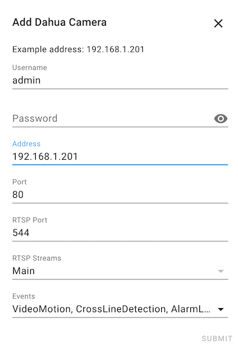

# Home Assistant Dahua Integration
The `Dahua` [Home Assistant](https://www.home-assistant.io) integration allows you to integrate your [Dahua](https://www.dahuasecurity.com/) cameras, doorbells, NVRs, DVRs in Home Assistant. It's also confirmed to work with some Lorex cameras and Amcrest devices.

Supports motion events, alarm events (and others), enabling/disabling motion detection, switches for infrared, illuminator (white light), security lights (red/blue flashers), sirens, doorbell button press events, and more.

Also exposes several services to enable/disable motion detection or set the text overlay on the video.

**NOTE**: Using the switch to turn on/off the infrared light will disable the "auto" mode. Use the service to enable auto mode again (or the camera UI).

Why not use the Amcrest integration already provided by Home Assistant? The Amcrest integration is missing features that this integration provides and I want an integration that is branded as Dahua. Amcrest are rebranded Dahua cams. With this integration living outside of HA, it can be developed faster and released more often. HA has release schedules and rigerous review processes which I'm not ready for while developing this integration. Once this integration is mature I'd like to move it into HA directly.

## Installation

If you want live-streaming, make sure to add the following to your config.yaml:
```
ffmpeg:
```
See [ffmpeg](https://www.home-assistant.io/integrations/ffmpeg/) and [stream](https://www.home-assistant.io/integrations/stream/).


### HACS install
To install with [HACS](https://hacs.xyz/):

1. Click on HACS in the Home Assistant menu
2. Click on `Integrations`
3. Click the `EXPLORE & ADD REPOSITORIES` button
4. Search for `Dahua`
5. Click the `INSTALL THIS REPOSITORY IN HACS` button
6. Restart Home Assistant
7. Configure the camera by going to `Configurations` -> `Integrations` -> `ADD INTERATIONS` button, search for `Dahua` and configure the camera.

### Manual install
To manually install:

```bash
# Download a copy of this repository
$ wget https://github.com/rroller/dahua/archive/dahua-main.zip

# Unzip the archive
$ unzip dahua-main.zip

# Move the dahua directory into your custom_components directory in your Home Assistant install
$ mv dahua-main/custom_components/dahua <home-assistant-install-directory>/config/custom_components/
```

> :warning: **After executing one of the above installation methods, restart Home Assistant. Also clear your browser cache before proceeding to the next step, as the integration may not be visible otherwise.**

### Setup
1. Now the integration is added to HACS and available in the normal HA integration installation, so...
2. In the HA left menu, click `Configuration`
3. Click `Integrations`
4. Click `ADD INTEGRATION`
5. Type `Dahua` and select it
6. Enter the details:
    1. **Username**: Your camera's username
    2. **Password**: Your camera's password
    3. **Address**: Your camera's address, typically just the IP address
    4. **Port**: Your camera's HTTP port. Default is `80`
    5. **RTSP Port**: Your camera's RTSP port, default is `554`. Used to live stream your camera in HA
    6. **Events**: The integration will keep a connection open to the camera to capture motion events, alarm events, etc.
       You can select which events you want to monitor and report in HA. If no events are selected then the connection will no be created.
       If you want a specific event that's not listed here open an issue and I'll add it.

NOTE: All streams will be added, even if not enabled in the camera. Just remove the ones you don't want.




# Known supported cameras
This integration should word with most Dahua cameras and doorbells. It has been tested with very old and very new Dahua cameras.

Doorbells will have a binary sensor that captures the doorbell pressed event.

* **Please let me know if you've tested with additional cameras**

These devices are confirmed as working:

## Dahua cameras


## Dahua cameras

Series | 2 Megapixels | 4 Megapixels | 5 Megapixels | 8 Megapixels
:------------ | :------------ | :------------ | :------------- | :-------------
| *Consumer Series* |
| | A26 |  |  |
| *1-Series* |
| | HFW1230S | HFW1435S-W |  |
| | HDBW1230E-S2 | HFW1435S-W-S2  |  |
| | |HDBW1431EP-S-0360B | |
| *2-/3-Series* |
| | HDW2831T-ZS-S2 |  | HDW3549HP-AS-PV | HDW3849HP-AS-PV
| | HDBW2231FP-AS-0280B-S2 |
| *4-/5-Series* |
| | HDW4231EM-ASE | HFW4433F-ZSA |  | HDW5831R-ZE
| | HDBW4231F-AS | HDBW5421E-Z |  |
| | HDW4233C-A | T5442T-ZE |
| | HDBW4239R-ASE |
| | HDBW4239RP-ASE |
| *6-/7-Series* |
| | HDPW7564N-SP |
| *Panoramic Series* |
| |  |  | EW5531-AS | 

## Other brand cameras

Brand | 2 Megapixels | 4 Megapixels | 5 Megapixels | 8 Megapixels
:------------ | :------------ | :------------ | :------------- | :-------------
| *IMOU* |
| | IMOU IPC-A26Z / Ranger Pro Z | | IMOU DB61i
| | IMOU IPC-C26E-V2 <sup>*</sup> |
| | IMOU IPC-K22A / Cube PoE-322A |
| *Lorex* |
| | | | | Lorex E891AB
| | | | | Lorex LNB8005-C
| | | | | Lorex LNE8964AB

<sup>*</sup> partial support

## Doorbell cameras

Brand | 2 Megapixels | 4 Megapixels | 5 Megapixels | 8 Megapixels
:------------ | :------------ | :------------ | :------------- | :-------------
| *Amcrest* |
| | Amcrest AD110 | Amcrest AD410
| *Dahua* |
| | DHI-VTO2202F-P |
| | DHI-VTO2211G-P |
| | DHI-VTO3311Q-WP |
| *IMOU* |
| | IMOU C26EP-V2 | | IMOU DB61i

# Known Issues
* IPC-D2B20-ZS doesn't work. Needs a [wrapper](https://gist.github.com/gxfxyz/48072a72be3a169bc43549e676713201), [7](https://github.com/bp2008/DahuaSunriseSunset/issues/7#issuecomment-829513144), [8](https://github.com/mcw0/Tools/issues/8#issuecomment-830669237)

# Events
Events are streamed from the device and fired on the Home Assistant event bus.

Here's example event data:

```json
{
    "event_type": "dahua_event_received",
    "data": {
        "name": "Cam13",
        "Code": "VideoMotion",
        "action": "Start",
        "index": "0",
        "data": {
            "Id": [
                0
            ],
            "RegionName": [
                "Region1"
            ],
            "SmartMotionEnable": false
        },
        "DeviceName": "Cam13"
    },
    "origin": "LOCAL",
    "time_fired": "2021-06-30T04:00:28.605290+00:00",
    "context": {
        "id": "199542fe3f404f2a0a81031ee495bdd1",
        "parent_id": null,
        "user_id": null
    }
}
```

And here's how you configure and event trigger in an automation:
```yaml
platform: event
event_type: dahua_event_received
event_data:
  name: Cam13
  Code: VideoMotion
  action: Start
```

And that's it! You can enable debug logging (See at the end of this readme) to print out events to the Home Assisant log
as they fire. That can help you understand the events. Or you can HA and open Developer Tools -> Events -> and under
"Listen to events" enter `dahua_event_received` and then click "Start Listening" and wait for events to fire (you might
need to walk in front of your cam to make motion events fire, or press a button, etc)

## Example Code Events
| Code | Description |
| ----- | ----------- |
| BackKeyLight    | Unit Events, See Below States |
| VideoMotion     | motion detection event |
| VideoLoss  | video loss detection event |
| VideoBlind     | video blind detection event |
| AlarmLocal     | alarm detection event |
| CrossLineDetection     | tripwire event |
| CrossRegionDetection     | intrusion event |
| LeftDetection     | abandoned object detection |
| TakenAwayDetection     | missing object detection |
| VideoAbnormalDetection    | scene change event |
| FaceDetection    | face detect event |
| AudioMutation    | intensity change |
| AudioAnomaly    | input abnormal |
| VideoUnFocus    | defocus detect event |
| WanderDetection    | loitering detection event |
| RioterDetection    | People Gathering event |
| ParkingDetection    | parking detection event |
| MoveDetection    | fast moving event |
| MDResult    | motion detection data reporting event. The motion detect window contains 18 rows and 22 columns. The event info contains motion detect data with mask of every row |
| HeatImagingTemper    | temperature alarm event |

## BackKeyLight States
| State | Description |
| ----- | ----------- |
| 0     | OK, No Call/Ring |
| 1, 2  | Call/Ring |
| 4     | Voice message |
| 5     | Call answered from VTH |
| 6     | Call **not** answered |
| 7     | VTH calling VTO |
| 8     | Unlock |
| 9     | Unlock failed |
| 11    | Device rebooted |

# Services and Entities
Note for ease of use, the integration tries to determine if your device supports certain services, entities and will conditionally add them. But that's sometimes a little hard so it'll just add the entity even if your devices doesn't support.
I'd rather opt into extra entities than to create a complicated flow to determine what's supported and what isn't. You can simply disable the entities you don't want. An example of this is the "door open state" for doorbells. Not all doorbells support this.

## Services
Service | Parameters | Description
:------------ | :------------ | :-------------
`camera.enable_motion_detection` | | Enables motion detection
`camera.disable_motion_detection` | | Disabled motion detection
`dahua.set_infrared_mode` | `target`: camera.cam13_main <br /> `mode`: Auto, On, Off <br /> `brightness`: 0 - 100 inclusive| Sets the infrared mode. Useful to set the mode back to Auto
`dahua.goto_preset_position` | `target`: camera.cam13_main <br /> `position`: 1 - 10 inclusive| Go to a preset position
`dahua.set_video_profile_mode` | `target`: camera.cam13_main <br /> `mode`: Day, Night| Sets the video profile mode to day or night
`dahua.set_focus_zoom` | `target`: camera.cam13_main <br /> `focus`: The focus level, e.g.: 0.81 0 - 1 inclusive <br /> `zoom`: The zoom level, e.g.: 0.72 0 - 1 inclusive | Sets the focus and zoom level
`dahua.set_channel_title` | `target`: camera.cam13_main <br /> `channel`: The camera channel, e.g.: 0 <br /> `text1`: The text 1<br /> `text2`: The text 2| Sets the channel title
`dahua.set_text_overlay` | `target`: camera.cam13_main <br /> `channel`: The camera channel, e.g.: 0 <br /> `group`: The group, used to apply multiple of text as an overly, e.g.: 1 <br /> `text1`: The text 1<br /> `text3`: The text 3 <br /> `text4`: The text 4 <br /> `text2`: The text 2 | Sets the text overlay on the video
`dahua.set_custom_overlay` | `target`: camera.cam13_main <br /> `channel`: The camera channel, e.g.: 0 <br /> `group`: The group, used to apply multiple of text as an overly, e.g.: 0 <br /> `text1`: The text 1<br /> `text2`: The text 2 | Sets the custom overlay on the video
`dahua.enable_channel_title` | `target`: camera.cam13_main <br /> `channel`: The camera channel, e.g.: 0 <br /> `enabled`: True to enable, False to disable | Enables or disables the channel title overlay on the video
`dahua.enable_time_overlay` | `target`: camera.cam13_main <br /> `channel`: The camera channel, e.g.: 0 <br /> `enabled`: True to enable, False to disable | Enables or disables the time overlay on the video
`dahua.enable_text_overlay` | `target`: camera.cam13_main <br /> `channel`: The camera channel, e.g.: 0 <br /> `group`: The group, used to apply multiple of text as an overly, e.g.: 0 <br /> `enabled`: True to enable, False to disable | Enables or disables the text overlay on the video
`dahua.enable_custom_overlay` | `target`: camera.cam13_main <br /> `channel`: The camera channel, e.g.: 0 <br /> `group`: The group, used to apply multiple of text as an overly, e.g.: 0 <br /> `enabled`: True to enable, False to disable | Enables or disables the custom overlay on the video
`dahua.set_privacy_masking` | `target`: camera.cam13_main <br /> `index`: The mask index, e.g.: 0 <br /> `enabled`: True to enable, False to disable | Enables or disabled a privacy mask on the camera
`dahua.set_record_mode` | `target`: camera.cam13_main <br /> `mode`: Auto, On, Off | Sets the record mode. On is always on recording. Off is always off. Auto based on motion settings, etc.
`dahua.enable_all_ivs_rules` | `target`: camera.cam13_main <br /> `channel`: The camera channel, e.g.: 0 <br /> `enabled`: True to enable all IVS rules, False to disable all IVS rules | Enables or disables all IVS rules
`dahua.enable_ivs_rule` | `target`: camera.cam13_main <br /> `channel`: The camera channel, e.g.: 0 <br /> `index`: The rule index <br /> enabled`: True to enable the IVS rule, False to disable the IVS rule | Enable or disable an IVS rule
`dahua.vto_open_door` | `target`: camera.cam13_main <br /> `door_id`: The door ID to open, e.g.: 1 <br /> Opens a door via a VTO
`dahua.vto_cancel_call` | `target`: camera.cam13_main <br />Cancels a call on a VTO device (Doorbell)
`dahua.set_video_in_day_night_mode` | `target`: camera.cam13_main <br /> `config_type`: The config type: general, day, night <br /> `mode`: The mode: Auto, Color, BlackWhite. Note Auto is also known as Brightness by Dahua|Set the camera's Day/Night Mode. For example, Color, BlackWhite, or Auto
`dahua.reboot` | `target`: camera.cam13_main <br />Reboots the device 


## Camera
This will provide a normal HA camera entity (can take snapshots, etc)

## Switches
Switch |  Description |
:------------ | :------------ |
Motion | Enables or disables motion detection on the camera
Siren | If the camera has a siren, will turn on the siren. Note, it seems sirens only stay on for 10 to 15 seconds before switching off
Disarming Linkage | Newer firmwares have a "disarming" feature (not sure what it is, but some people use it). This allows one to turn it on/off. This is found in the UI by going to Event -> Disarming

## Lights
Light |  Description |
:------------ | :------------ |
Infrared | Turns on/off the infrared light. Using this switch will disable the "auto" mode. If you want to enable auto mode again then use the service to enable auto. When in auto, this switch will not report the on/off state.
Illuminator | If the camera has one, turns on/off the illuminator light (white light). Using this switch will disable the "auto" mode. If you want to enable auto mode again then use the service to enable auto. When in auto, this switch will not report the on/off state.
Security | If the camera has one, turns on/off the security light (red/blue flashing light). This light stays on for 10 to 15 seconds before the camera auto turns it off.

## Binary Sensors
Sensor |  Description |
:------------ | :------------ |
Motion | A sensor that turns on when the camera detects motion
Button Pressed | A sensor that turns on when a doorbell button is pressed
Others | A binary senor is created for evey event type selected when setting up the camera (Such as cross line, and face detection)

# Local development
If you wish to work on this component, the easiest way is to follow [HACS Dev Container README](https://github.com/custom-components/integration_blueprint/blob/master/.devcontainer/README.md). In short:

* Install Docker
* Install Visual Studio Code
* Install the devcontainer Visual Code plugin
* Clone this repo and open it in Visual Studio Code
* View -> Command Palette. Type `Tasks: Run Task` and select it, then click `Run Home Assistant on port 9123`
* Open Home Assistant at http://localhost:9123

# Debugging
Add to your configuration.yaml:

```yaml
logger:
  default: info
  logs:
    custom_components.dahua: debug
```

# Curl/HTTP commands

```bash
# Stream events
curl -s --digest -u admin:$DAHUA_PASSWORD  "http://192.168.1.203/cgi-bin/eventManager.cgi?action=attach&codes=[All]&heartbeat=5"

# List IVS rules
http://192.168.1.203/cgi-bin/configManager.cgi?action=getConfig&name=VideoAnalyseRule

# Enable/Disable IVS rules for [0][3] ... 0 is the channel, 3 is the rule index. Use the right index as required
http://192.168.1.203/cgi-bin/configManager.cgi?action=setConfig&VideoAnalyseRule[0][3].Enable=false

# Enable/disable Audio Linkage for an IVS rule
http://192.168.1.203/cgi-bin/configManager.cgi?action=setConfig&VideoAnalyseRule[0][3].EventHandler.VoiceEnable=false
```

# References and thanks
* Thanks to @elad-ba for his work on https://github.com/elad-bar/DahuaVTO2MQTT which was copied and modified and then used here for VTO devices
* Thanks for the DAHUA_HTTP_API_V2.76.pdf API reference found at http://www.ipcamtalk.com
* Thanks to all the people opening issues, reporting bugs, pasting commands, etc
