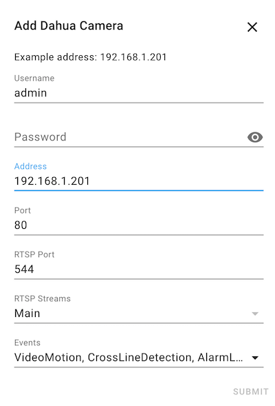

# Home Assistant Dahua Integration
The `Dahua` [Home Assistant](https://www.home-assistant.io) integration allows you to integrate your [Dahua](https://www.dahuasecurity.com/) cameras, doorbells, NVRs, DVRs in Home Assistant. It's also confirmed to work with some Lorex cameras and Amcrest devices.

Supports motion events, alarm events (and others), enabling/disabling motion detection, switches for infrared, illuminator (white light), security lights (red/blue flashers), sirens, doorbell button press events, and more.

Also exposes several services to enable/disable motion detection or set the text overlay on the video.

**NOTE**: Using the switch to turn on/off the infrared light will disable the "auto" mode. Use the service to enable auto mode again (or the camera UI).

Why not use the Amcrest integration already provided by Home Assistant? The Amcrest integration is missing features that this integration provides and I want an integration that is branded as Dahua. Amcrest are rebranded Dahua cams. With this integration living outside of HA, it can be developed faster and released more often. HA has release schedules and rigerous review processes which I'm not ready for while developing this integration. Once this integration is mature I'd like to move it into HA directly.

## What you can do with it

- **Act on what the camera sees.** Motion, tripwire, intrusion, abandoned object,
  human and vehicle detection and the rest arrive on the event bus and as binary
  sensors, so an automation can notify you or turn on a light without polling
  anything.
- **Answer the door.** A doorbell press arrives as an `event` entity for "somebody
  rang at 19:42" and as a binary sensor that holds for a few seconds for automations
  to wait on, and there is a button and a service to release the lock.
- **Sound the alarm.** On devices with the hardware, the siren, the red and blue
  security light and a physical alarm output relay can all be switched from an
  automation.
- **Use the camera's own lights.** The white illuminator and the infrared light are
  `light` entities, so the camera can light the drive on an automation and be handed
  back to its own automatic mode afterwards.
- **Stop it watching while you are home.** Motion detection, smart motion detection,
  recording mode, privacy masks and the motorised lens cover are all switchable, so
  presence can turn the cameras down rather than off.
- **Open the gate for a car you know.** On cameras with ANPR, the recognised plate is
  a sensor, and naming the plates you trust gives a binary sensor that turns on only
  for those.
- **Write on the video.** The channel title, the timestamp and free text overlays can
  be set from an automation, which is how a temperature or a zone name gets burned
  into the recording.
- **Watch what it recorded.** Recordings on the device's own storage show up in Home
  Assistant's Media browser under **Dahua**, by camera and then by day, and play back
  in the dashboard. See [Recordings](#recordings).

## Installation

If you want live-streaming, make sure to add the following to your config.yaml:
```
ffmpeg:
```
See [ffmpeg](https://www.home-assistant.io/integrations/ffmpeg/) and [stream](https://www.home-assistant.io/integrations/stream/).


### Requirements

Home Assistant **2026.8.0** or newer. HACS will not offer the integration on anything
older, because a recorder's channels are stored as config **subentries** and that needs
a recent Home Assistant.

### HACS install
To install with [HACS](https://hacs.xyz/):

1. Click on HACS in the Home Assistant menu
2. Click on `Integrations`
3. Click the `EXPLORE & ADD REPOSITORIES` button
4. Search for `Dahua`
5. Click the `INSTALL THIS REPOSITORY IN HACS` button
6. Restart Home Assistant
7. Configure the camera by going to `Configurations` -> `Integrations` -> `ADD INTERATIONS` button, search for `Dahua` and configure the camera.

### Pre-release versions

Fixes land in a pre-release first, usually within a day, and are gathered into
a stable release afterwards. Pre-releases are hidden unless you ask for them,
so if you do nothing, nothing changes: you keep being offered stable releases
only.

To opt in:

1. `Settings` -> `Devices & services` -> `Integrations` tab
2. Open `HACS`
3. Find the `Dahua` integration
4. Turn on the pre-release toggle

You will then be offered pre-releases as updates, the same way as stable ones.
Turn it back off at any time and the next stable release brings you back to the
stable line.

Worth knowing before you opt in:

- Pre-releases get less testing than stable, by definition. Do not run one on a
  camera you cannot afford to have misbehave for an afternoon.
- **If you report a problem, say which version you are on.** This matters more
  here than on stable.
- Finding things before they reach everyone is the whole point, so a report
  from a pre-release user is worth a great deal. If something breaks, please
  open an issue rather than quietly rolling back.

### Manual install
To manually install:

```bash
# Download a copy of this repository
$ wget https://github.com/rroller/dahua/archive/refs/heads/main.zip

# Unzip the archive
$ unzip main.zip

# Move the dahua directory into your custom_components directory in your Home Assistant install
$ mv dahua-main/custom_components/dahua <home-assistant-install-directory>/config/custom_components/
```

> :warning: **After executing one of the above installation methods, restart Home Assistant. Also clear your browser cache before proceeding to the next step, as the integration may not be visible otherwise.**

### Before you start: settings on the device

Home Assistant talks to the device directly over its local HTTP API. Six things are
decided **on the camera or recorder**, not in Home Assistant, and each one has been
the entire cause of a failed setup for somebody. If you are setting up a device for
the first time, it is worth checking these before you begin rather than after.

Menu paths differ between firmware generations, so treat these as the setting to
look for rather than an exact route.

1. **The CGI service must be enabled.**
   `System` → `Safety` (or `Security`) → `System Service` → `CGI Service`.
   On some firmwares it is under `Local Settings` → `Security`.
   *How to tell:* open `http://<address>/cgi-bin/magicBox.cgi?action=getMachineName`
   in a browser. A **404** means CGI is off. A login prompt means it is on.

2. **Use an account on the device, not a cloud account.**
   The Dahua, Imou or Amcrest **app** login is a cloud account and will not work
   here. You need a user created on the device itself, and it is usually `admin`
   in lower case. Watch for a phone keyboard capitalising it.

3. **If you have never set a password**, it is the *safety code* printed on the
   device's label. A device that has never been initialised has no account at all
   and has to be initialised first, through its own web interface or ConfigTool.

4. **Authentication mode must be Compatible, not Safety.**
   `Network` → `Basic Services` → `Authentication`, or on recorders
   `Security` → `System Service` → `Basic Services` → `Private Protocol
   Authentication Mode`. Set it to **Compatibility Mode**.

5. **The digest algorithm must include MD5.**
   `System` → `Security` → `Security Authentication`. With MD5 disabled the device
   answers `500` to API calls. Selecting **more than one** algorithm for user
   authentication is also known to break RTSP streaming, so MD5 alone is the
   working combination people report.

6. **Decide about HTTPS deliberately.**
   If HTTPS is enabled on the device, either turn it off, or tick **Use HTTPS** in
   Home Assistant and use port `443`. An HTTPS device added over plain HTTP on
   port 80 will not connect, and this has caught people out after a firmware
   update switched it on by itself.

Two more that affect video rather than the connection: at least one sub-stream
should be **H.264** rather than H.265, because H.265 will not render in the browser,
and the sub-stream you intend to use has to be enabled on the device.

> :warning: **Repeated failed logins will lock you out.** Dahua devices lock the
> source IP after a number of failed attempts. At least one recorder reports its own
> policy as 5 failures then a 300 second lock, and separately a device can refuse
> with "Exceeded maximum number of connections", which needs a reboot rather than a
> wait. If setup fails, fix the cause rather than retrying the same credentials.

### Setup

1. In the Home Assistant left menu, click **Settings**
2. Click **Devices & services**
3. Click **ADD INTEGRATION**
4. Type `Dahua` and select it
5. Enter the details:
    1. **Username**: an account on the device, usually `admin` (see above)
    2. **Password**: that account's password
    3. **Address**: the device's IP address or hostname
    4. **Port**: the HTTP port. `80` normally, or `443` for HTTPS
    5. **RTSP port**: `554` normally. Used to stream the camera in Home Assistant
    6. **Use HTTPS**: tick this if the device serves HTTPS on the port above.
       Left unticked, HTTPS is used only when the port is `443`
    7. **Channel**: **counted from 0.** A single camera is `0`. On a recorder this
       is one less than the number the recorder shows, so its channel 4 is `3`
       here. You only need the first one: the recorder's other channels are
       offered on the next screen, where they are listed by the number the
       recorder itself uses

Only **username**, **password**, **address** and **channel** are asked at first.
**Port**, **RTSP port** and **Use HTTPS** appear only if the connection fails, because
their defaults are right on almost every device and a form that asks eight questions to
add one camera is a form people get wrong. Which events become binary sensors is not
asked here either: it is on the options screen, where it can be changed afterwards
without removing the camera.

On a recorder, the next screen offers the other channels that have a live camera on
them, and the one after that lets you file each of them in an area. Channels that
are empty, switched off, or reached over ONVIF are not offered, because this
integration cannot drive them.

The last screen asks for a name and shows a **still from the channel you chose**, so a
channel number that is off by one is caught by looking rather than after the entry
exists. A device that will not serve a snapshot simply shows no picture.

NOTE: An entity is added for every stream the device can serve, whether or not that
stream is enabled on the device, because which ones exist cannot be known without
asking and asking costs a request per channel. **Only the main stream is enabled to
begin with.** The sub streams are listed but switched off, so if you want to point a
card at one, enable it from the entity's own page. Nothing that already exists is
affected by this: a sub stream camera you are already using stays exactly as it is.



### Upgrading from a version before 1.0

Earlier versions added **one config entry per channel**, so a sixteen channel recorder
appeared as sixteen separate integrations. From 1.0 a recorder is **one entry with one
subentry per channel**, which is what lets the channels share a single login and a single
event connection instead of opening sixteen of each.

The first start after upgrading merges them for you. Nothing needs to be re-added and
entity ids are kept, so automations and dashboards continue to work.

**A copy of the registries is saved first.** Before anything is changed, these three files
are copied out of `.storage`:

```
core.config_entries
core.device_registry
core.entity_registry
```

into a new directory named for the time it ran:

```
/config/dahua-pre-merge-backup-20260930-142824
```

The path is written to the log as a warning, so searching the log for
`dahua-pre-merge-backup` will find it. If the backup cannot be written the merge is **not
attempted**, and the log says so.

To go back, stop Home Assistant, copy those three files back into `/config/.storage`, and
start it again. It has to be done with Home Assistant stopped, because it rewrites the
files on shutdown. The merge cannot be undone from inside Home Assistant, so keep the
directory until you are happy with the result.

### If it will not connect

The error on the form names the cause where it can. What each one means:

| What you see | What it usually is |
|---|---|
| The camera rejected that username and password | A genuine 401. Check it is a device account and not a cloud one, and that `admin` is lower case |
| That address is serving web pages, but not the Dahua API | The CGI service is switched off. Prerequisite 1 above |
| Nothing answered on that port, but the device is listening on 443 | It is serving HTTPS. Tick **Use HTTPS** and use port `443` |
| The device is answering Dahua's own protocol, but nothing is serving HTTP | The device is alive and its web service is off. Turn on HTTP and CGI in System Service |
| The secure connection failed | Either the device does not serve HTTPS on that port, or it does and it is on `443`. Self-signed certificates are accepted and are not the problem |
| Nothing answered at that address and port | Nothing is listening. Check the address, and that Home Assistant can reach that subnet |
| The camera did not answer in time | Reachable but slow or busy. Check the port is the one it serves HTTP on |

Two cases the form cannot diagnose for you:

- **Some devices have no local API at all.** Cloud-only Imou and Lechange models, and
  some doorbells whose firmware moved to the cloud app, serve no `/cgi-bin/` API.
  There is nothing this integration can do for those; ONVIF or the vendor's cloud
  integration is the route. A downgrade to earlier firmware has restored the local
  API for some people.
- **Cameras behind a recorder's own PoE ports** often sit on a private subnet, such
  as `10.1.1.x`, that Home Assistant cannot route to. Add them through the
  recorder's address and channel number instead of trying to reach them directly.


### Diagnostics

Every device page has **Download diagnostics** under the three dot menu. It is the most
useful thing to attach to an issue, and it is worth looking at yourself first.

Credentials are removed before the file is written: the username, the password, the serial
number and the unique id are replaced with `**REDACTED**`, and any RTSP URL has its
credentials swapped for `REDACTED` rather than being included and hidden.

Three fields answer most "my sensors stopped working" questions, all under `events`:

| field | what it tells you |
| :------------ | :------------ |
| `configured` | the event codes this channel actually subscribed to. If the code you expect is missing, the device was never asked for it |
| `subscribed_as` | how the request went out: the list of codes, or `["All"]` if the device refused a list (see below) |
| `arrived_with_no_listener` | events the device **did** send that nothing was listening for. A non-zero count here means the event is arriving and being dropped, which is a different problem from the device not sending it |

Together they separate the three possibilities: never subscribed, subscribed but the
device sent nothing, or sent and dropped.

### Removing it

1. In **Settings > Devices & services**, find **Dahua**
2. Click the three dots beside the device and choose **Delete**
3. Confirm

One device is one config entry. A recorder is also one entry, holding one subentry per
channel, so deleting the entry removes the whole recorder and every channel with it.
To remove a single channel of a recorder, delete that channel rather than the entry.

Nothing is left behind on the device. The integration only reads settings and holds an
event connection, and deleting the entry ends both. Settings you changed from Home
Assistant are the device's own settings and stay as you left them, so if you turned
motion detection off, or left the illuminator on, put it back from the device's web UI
or the Dahua app.

To remove the integration itself, delete it in HACS, or delete the
`custom_components/dahua` directory if you installed it by hand, and restart Home
Assistant.


# Known supported cameras
This integration should word with most Dahua cameras and doorbells. It has been tested with very old and very new Dahua cameras.

Doorbells will have a binary sensor that captures the doorbell pressed event.

* **Please let me know if you've tested with additional cameras**

These devices are confirmed as working:

## Dahua cameras

Series | 2 Megapixels | 4 Megapixels | 5 Megapixels | 6 Megapixels | 8 Megapixels
:------------ | :------------ | :------------ | :------------- | :------------- | :-------------
| *Consumer Series* |  |  |  |  |  |
|  | A26 |  |  |  |  |
| *1-Series* |  |  |  |  |  |
|  | HFW1230S | HFW1431S1-S4 |  |  |  |
|  | HDBW1230E-S2 | HFW1435S-W |  |  |  |
|  |  | HFW1435S-W-S2 |  |  |  |
|  |  | HDBW1431EP-S-0360B |  |  |  |
| *2-/3-Series* |  |  |  |  |  |
|  | HDW2831T-ZS-S2 | HDW2431TP-AS | HDW3549HP-AS-PV |  | HDW3849HP-AS-PV |
|  | HDBW2231FP-AS-0280B-S2 | HDBW2431R-ZS | HFW3549T1-AS-PV-0280B-S3 |  |  |
|  |  | HFW2449S-S-IL |  |  |  |
|  |  | HFW3441E-AS-S2 |  |  |  |
| *4-/5-Series* |  |  |  |  |  |
|  | HDW4231EM-ASE | HFW4433F-ZSA |  | HDW4631EM-ASE | HDW5831R-ZE |
|  | HDBW4231F-AS | HDBW5421E-Z |  |  |  |
|  | HDW4233C-A | T5442T-ZE |  |  |  |
|  | HDBW4239R-ASE | T5442TM-AS |  |  |  |
|  |  | B5442E-Z4E |  |  |  |
|  |  | B54IR-ASE |  |  |  |
|  | HDBW4239RP-ASE |  |  |  |  |
| *PTZ Series* |  |  |  |  |  |
|  | SD1A203T-GN |  |  |  |  |
|  | SD42212S-HN |  |  |  |  |
| *Thermal Series* |  |  |  |  |  |
|  | TPC-BF2221P-B3F4 |  |  |  |  |
| *6-/7-Series* |  |  |  |  |  |
|  | HDPW7564N-SP |  |  |  |  |
| *Panoramic Series* |  |  |  |  |  |
|  |  |  | EW5531-AS |  |  |

## Other brand cameras

Brand | 2 Megapixels | 4 Megapixels | 5 Megapixels | 8 Megapixels
:------------ | :------------ | :------------ | :------------- | :-------------
| *Amcrest* |
| | | | Amcrest IP5M-T1179E | Amcrest IPC-Color4K-T
| *EmpireTech* |
| | | IPC-Color4M-TZ | | PTZ3E10X-T180 <sup>†</sup>
| *IMOU* |
| | IMOU IPC-A26Z / Ranger Pro Z | | IMOU DB61i
| | IMOU IPC-C26E-V2 <sup>*</sup> |
| | IMOU IPC-K22A / Cube PoE-322A |
| *Lorex* |
| | | | | Lorex E891AB/E893DD
| | | | | Lorex LNB8005-C
| | | | | Lorex LNE8964AB

<sup>*</sup> partial support

<sup>†</sup> dual-sensor camera with an 8 MP overview channel and a 4 MP PTZ channel

## Models recognised for a siren or a security light

The tables above are devices someone has confirmed working. This is a different and weaker
claim: these are model names the integration **looks for by name** when it cannot detect a
siren or a white security light any other way. If your model is here, the control should
appear even when the device does not report the capability.

| model | what it gets |
| :------------ | :------------ |
| anything containing `AS-PV` | siren and security light |
| anything containing `L46N` | siren |
| anything containing `TPC-BF1241` | siren |
| anything starting `W452ASD` | siren |
| `AD410`, `DB61I` | security light |
| anything starting `IP8M-2796E` | security light |
| anything starting `IPC-COLOR4M-TZ` | security light |
| anything starting `PTZ3E10X-T180` | security light |

Matching by model name is a fallback, not the first choice, and it is the wrong shape:
it fails on a device that has the hardware and is not on the list. If yours is missing,
say so on an issue and include the diagnostics download, which lists what was and was not
detected under `supports_siren_sources` and
`supports_security_light_sources`. The
`manual_siren` and `manual_security_light` options force the control on in the meantime.

## Doorbell cameras

Brand | 2 Megapixels | 4 Megapixels | 5 Megapixels | 8 Megapixels
:------------ | :------------ | :------------ | :------------- | :-------------
| *Amcrest* |
| | Amcrest AD110 | Amcrest AD410
| *Dahua* |
| | DHI-VTO2202F-P |
| | DHI-VTO2211G-P |
| | DHI-VTO3311Q-WP |
| | DHI-VTO2211G-WP-S2 |
| *IMOU* |
| | IMOU C26EP-V2 | IMOU IPC-K46 | IMOU DB61i

## Indoor monitors (VTH)

Model | Firmware
:------------ | :------------
VTH2421F-P | 4.800.0000000.1.R

Add an indoor monitor like any other device, by its address and an account on the
monitor itself (usually the same as the VTO's). A VTH serves no CGI at all, so the
integration identifies it over RPC2 and shows its real model and firmware.

What it gets:

- A **Camera for &lt;VTO&gt; calls** select for each VTO it knows: the camera its screen opens on
  when that VTO calls. `none` is the VTO's own picture; the other options are the cameras in
  the monitor's own camera list (Monitor > IPC on its screen). The monitor's screen has no
  control for this on the measured firmware, though its manual describes it.
- Reboot, firmware version and serial number.

A monitor that reports it has no camera of its own (`SupportVideo` false in its
`RemoteDevice` table, as on the VTH2421F-P) gets no camera entities, no camera event
sensors, no event stream, no motion detection switch, no Day/Night select, no Preset
Position, and no License Plate or Authorized Vehicle entities.

The serial number shown is generated from the address and login, as for every device
whose CGI does not answer, so that it stays stable; it is not the serial printed on the
monitor.

To ring a monitor, use [`dahua.vto_call`](#services) on the VTO, not on the monitor.

# Known limitations

What this integration cannot do, as distinct from the bugs and firmware quirks under
[Known Issues](#known-issues).

- **Settings are polled, so a change made elsewhere is not instant.** Turning a light
  on from the Dahua app appears in Home Assistant within one poll interval, 30 seconds
  by default and 10 at the fastest. Events are pushed and are not affected by this.
  See [How data is updated](#how-data-is-updated).
- **The infrared and illuminator lights have three states, and a light entity has
  two.** Switching either on takes the camera out of Auto, and while it is in Auto the
  entity cannot report on or off because the camera does not say which it is. Use
  `dahua.set_infrared_mode` or `dahua.set_illuminator_mode` to hand Auto back.
- **A device with no local API cannot be used at all.** Cloud only Imou and Lechange
  models, and some doorbells whose firmware moved to the vendor's app, serve no
  `/cgi-bin/` API. ONVIF or the vendor's own integration is the route for those.
- **Cameras on a recorder's own PoE ports are usually not reachable directly**, because
  they sit on a private subnet Home Assistant cannot route to. Add them through the
  recorder's address and channel number instead.
- **Channels a recorder reaches over ONVIF cannot be driven**, and are not offered when
  adding one. This integration speaks Dahua's own API and an ONVIF channel does not
  answer it.
- **Active deterrence through a recorder is undocumented and unreliable.** Whether an
  NVR passes a siren or white light command through to the camera behind it varies by
  model, and on some it accepts the command and does nothing at all. That is why those
  entities are off by default rather than created automatically.
- **A large configuration write can be refused on a recorder.** RPC2 answers
  `Request length error!` to a big `setConfig`, and a recorder's IVS rule table can be
  large enough to hit that, so an IVS rule switch may fail to toggle. Measured on one
  recorder, where writes from 9KB upwards were refused. A single camera's table is far
  smaller and is not affected.
- **No triggers or conditions are provided.** Events reach the bus as
  `dahua_event_received` and become binary sensors, and automations are written against
  those. There are no integration specific trigger or condition types.
- **The siren and the security light switch themselves off** after 10 to 15 seconds.
  That is the device's own behaviour and cannot be extended from here.
- **Recorders cap how many RTSP streams they serve at once**, often quite low, so
  several cards watching several channels can fail where one channel works.
- **Not every camera has every entity.** The illuminator, the security light, the
  siren, smart motion detection, PTZ presets, ANPR and the motorised lens cover are
  each created only on devices that report them. If one is missing and you know the
  hardware is there, see the manual enable options under
  [Channel options](#channel-options).

# Known Issues

* **A camera that shows a still image but never a moving stream is usually sending H.265.** Home Assistant handles H.264 reliably; an H.265 stream commonly gives a camera that is plainly online, with entities that populate and a picture that updates when you click it, and a live view that never plays. HomeKit will not play H.265 at all.

  Fix it on the device, not in Home Assistant: in the camera or recorder's web UI, under **Video > Encode**, set the stream you use to **H.264**. If you want the low bandwidth path, set the *sub* stream to H.264 and point the card at the sub stream. Adding `ffmpeg:` to `configuration.yaml` does not change this, so having added it does not rule the codec out.

  Reported as [#236](https://github.com/rroller/dahua/issues/236), [#244](https://github.com/rroller/dahua/issues/244), [#257](https://github.com/rroller/dahua/issues/257), [#262](https://github.com/rroller/dahua/issues/262) and [#272](https://github.com/rroller/dahua/issues/272), among others.

  If the stream error is `Operation timed out` rather than a demuxing failure, that is a different problem: the device is not answering RTSP at all, which points at the RTSP port or at how many simultaneous streams it allows. Recorders in particular cap that quite low.

* IPC-D2B20-ZS doesn't work. Needs a [wrapper](https://gist.github.com/gxfxyz/48072a72be3a169bc43549e676713201), [7](https://github.com/bp2008/DahuaSunriseSunset/issues/7#issuecomment-829513144), [8](https://github.com/mcw0/Tools/issues/8#issuecomment-830669237)
* **Versions between 0.9.84 and 0.9.92 could leave the illuminator switched on in a profile you are not using.** In that window the illuminator wrote to the wrong day/night profile on some cameras ([#605](https://github.com/rroller/dahua/issues/605), [#582](https://github.com/rroller/dahua/issues/582)); which versions affected you depends on the camera, and 0.9.93 fixed the write for both kinds. It does not undo what the earlier versions wrote. If you turned the illuminator on during that window, `Lighting_V2[<channel>][0][0].Mode` may still be `Manual` on the Day profile.

  While the camera is in General mode this does nothing at all. But if the camera is ever switched to Day/Night profile management, the light comes on when that profile becomes active, looking as though it did so by itself. Home Assistant will report it as on and can turn it off — but only once you notice it.

  The integration deliberately does not correct this for you, because doing so would mean writing to a profile you are not currently using, on every camera, unprompted. To check for it and clear it by hand, see [Curl/HTTP commands](#curlhttp-commands).

# How data is updated

Two separate things happen, on two separate schedules, and most confusion about this
integration comes from reading one as the other.

**Events are pushed, and arrive as soon as the device sends them.** The integration holds a long
lived connection to the device and the device writes to it when something happens.
Motion, tripwire, a doorbell press and everything else in the Events section arrive
this way. The poll interval has no effect on them at all.

There are three of these connections, and which one a device gets depends on what it
serves:

| Transport | Used for | How it works |
|---|---|---|
| `eventManager.cgi` multipart stream | almost every camera and recorder | One HTTP connection the device streams event payloads down, held open for as long as the entry is loaded |
| DHIP on TCP port 5000 | doorbells (VTO) | A separate binary protocol connection, which is also what carries a doorbell's card reader and call events |
| RPC2 polling | firmware that serves no CGI at all | Some devices answer 404 to every `/cgi-bin/` path. RPC2 has no readable subscription, so the alarm state of each selected code is polled and its edges are turned into the same event payloads. This is the only transport that is not push |

A connection that drops is reconnected with a backoff, so a camera that is unplugged
is not contacted every few seconds for ever.

**Settings are polled, every 30 seconds by default.** Whether motion detection is on,
which lights are on, the day/night profile, the PTZ preset, the recording mode: these
are the device's own configuration, and the only way to know they changed is to ask.
That is what the poll interval is, it can be set per entry from 10 seconds upwards,
and it is also why a change made in the Dahua app takes up to one interval to appear
in Home Assistant.

Turning a platform off stops the requests that exist only to feed it, so the poll gets
cheaper as well as quieter. See [Reducing entries in your device's
log](#reducing-entries-in-your-devices-log).

Reads are shared and cached where the device allows it: channels of one recorder share
a single host wide read rather than asking once each, and a device that stops answering
is backed off rather than retried at the same rate.

# Events
Events are streamed from the device and fired on the Home Assistant event bus.

Here's example event data:

```json
{
    "event_type": "dahua_event_received",
    "data": {
        "name": "Cam13",
        "Code": "VideoMotion",
        "action": "Start",
        "index": "0",
        "data": {
            "Id": [
                0
            ],
            "RegionName": [
                "Region1"
            ],
            "SmartMotionEnable": false
        },
        "DeviceName": "Cam13"
    },
    "origin": "LOCAL",
    "time_fired": "2021-06-30T04:00:28.605290+00:00",
    "context": {
        "id": "199542fe3f404f2a0a81031ee495bdd1",
        "parent_id": null,
        "user_id": null
    }
}
```

And here's how you configure and event trigger in an automation:
```yaml
platform: event
event_type: dahua_event_received
event_data:
  name: Cam13
  Code: VideoMotion
  action: Start
```

And that's it! You can enable debug logging (See at the end of this readme) to print out events to the Home Assisant log
as they fire. That can help you understand the events. Or you can HA and open Developer Tools -> Events -> and under
"Listen to events" enter `dahua_event_received` and then click "Start Listening" and wait for events to fire (you might
need to walk in front of your cam to make motion events fire, or press a button, etc)

## An event on the bus does not mean a sensor will update

These are two separate things, and reading one as the other has produced several
issue reports where nothing was actually broken.

**Every event that arrives is put on the bus, before anything else happens.** It is
fired with the raw code the device sent, before any translation and before any sensor
is considered. So if you see a code in `dahua_event_received`, the connection to the
device and the event stream are working. That is all it proves.

**A binary sensor only updates if you selected that event for that entry.** The
sensors that exist come from the event list on the entry, and an event you did not
select has no sensor and no listener, so nothing is written. (Doorbells are the one
exception: they always get Doorbell Pressed, Invite, Door Status and Call No
Answered, because almost everybody wants them.) Seeing
`CrossRegionDetection` on the bus while a Smart Motion sensor stays off is exactly
what a correctly working system looks like when `SmartMotionHuman` was not selected.

To change the selection: **Settings, Devices and Services, Dahua, Configure**, on the
entry you mean. Ticking boxes in the camera's own web interface does not affect which
Home Assistant entities exist.

### Per-rule IVS binary sensors

Each complete `Class=Normal` rule with a unique Dahua ID creates a binary sensor,
including rule types such as `StayDetection`. Discovery happens during setup;
reload the integration after adding rules. Direct cameras use `VideoAnalyseRule`,
and NVR channels use the per-channel `RemoteVideoAnalyseRule` read. Keep that read
shape: some NVR firmware reports different IDs when reading the whole recorder.

To activate a per-rule sensor, a Start must carry `Class=Normal` and a matching
`RuleId` or `RuleID`. The integration does not guess a match from the rule name
or array position. NVR configuration IDs and event IDs still need comparison on
real hardware; a discovered entity alone does not prove that its event IDs match.
A Stop clears all active rules with the same event Code on that channel: Dahua
emits one Start per rule but a single Stop for the whole code, and that Stop
names only one rule. The integration clears the rules that code actually lit,
falling back to the rules' configured Type after a reload. This also handles a
Stop without usable rule data. Pulse events use the existing short hold before clearing.

The downloaded diagnostics contain an `ivs` section for every configured channel:
the setup read source, discovered count, skipped row indexes and reasons, and
unmatched event counts with the most recent channel/code/rule ID. Missing IDs,
duplicate IDs, and invalid Enable values explain why rows were skipped. Read
failures report the exception type. Counts cover the current coordinator lifetime.
Debug logging records the discovery summary and the first unmatched event of each
reason. These diagnostics use existing reads and do not make extra device requests.

### Smart Motion is derived from the IVS event

Many cameras never send `SmartMotionHuman` at all. They send `CrossLineDetection` or
`CrossRegionDetection` carrying an object type, and the integration fires the matching
smart motion code as well:

```
Code: CrossRegionDetection
data:
  Object:
    ObjectType: Human
```

becomes both `CrossRegionDetection` and `SmartMotionHuman`, so on such a camera
`SmartMotionHuman` is the better sensor to use: it fires only for people, where the
Cross Region one fires for anything that trips the rule. Both fire when both are
selected. But the smart motion sensor only exists if you selected it, so on a camera
sending the payload above you can see `CrossRegionDetection` on the bus all day and
get nothing from Smart Motion until it is ticked.

### Events are per channel

On a recorder each channel is its own entry with its own event list, and an event
updates the sensor belonging to the channel it came from. If channel 1 has
`SmartMotionHuman` selected and channel 2 does not, motion on channel 2 appears on the
bus and updates nothing.

### A device that will not accept a list of event codes

Some firmware serves the event stream perfectly and refuses a long list of codes. Measured
on two different cameras: an IPC-HFW4300S-V2 answers `codes=[VideoMotion]` with 200 and the
same request carrying nine codes with **400**, and a Hero A1 answers **500** to those nine.

When that happens the integration notices the refusal and asks again with `codes=[All]`,
filtering locally instead. **Your event selection is unaffected**, because the filtering
happens here rather than on the device. It is tried once per stream, and a warning naming
the status is logged so you can see it happened.

`subscribed_as` in the diagnostics says which form is in use. If it reads `["All"]` and you
did not select every event, this is why.

This was the cause of [#728](https://github.com/rroller/dahua/issues/728), which read as
"everyone with a single camera" rather than as a firmware quirk: the workaround existed
before, but it was chosen by guessing whether a request looked too long instead of waiting
for the device to say so, and that guess can never be true for a single camera.

### A sensor that says "no longer being provided"

If you deselect an event, its sensor is not created next time the entry loads, and
Home Assistant leaves the old entity behind showing `unavailable` with "This entity is
no longer being provided by the dahua integration". That is Home Assistant reporting
an entity nothing owns any more, not a fault in the integration, and it will never
update again. Either select the event again, or delete the entity from its own page.
Reloading or restarting will not clear it. The same applies to a per-rule IVS
sensor after its rule is deleted from the device.

## Example Code Events
| Code | Description |
| ----- | ----------- |
| BackKeyLight    | Unit Events, See Below States |
| VideoMotion     | motion detection event |
| VideoLoss  | video loss detection event |
| VideoBlind     | video blind detection event |
| AlarmLocal     | alarm detection event |
| CrossLineDetection     | tripwire event |
| CrossRegionDetection     | intrusion event |
| LeftDetection     | abandoned object detection |
| TakenAwayDetection     | missing object detection |
| VideoAbnormalDetection    | scene change event |
| FaceDetection    | face detect event |
| AudioMutation    | intensity change |
| AudioAnomaly    | input abnormal |
| VideoUnFocus    | defocus detect event |
| WanderDetection    | loitering detection event |
| RioterDetection    | People Gathering event |
| ParkingDetection    | parking detection event |
| MoveDetection    | fast moving event |
| MDResult    | motion detection data reporting event. The motion detect window contains 18 rows and 22 columns. The event info contains motion detect data with mask of every row |
| HeatImagingTemper    | temperature alarm event |

## BackKeyLight States
| State | Description |
| ----- | ----------- |
| 0     | OK, No Call/Ring |
| 1, 2  | Call/Ring |
| 4     | Voice message |
| 5     | Call answered from VTH |
| 6     | Call **not** answered |
| 7     | VTH calling VTO |
| 8     | Unlock |
| 9     | Unlock failed |
| 11    | Device rebooted |

# Services and Entities
Note for ease of use, the integration tries to determine if your device supports certain services and entities and will conditionally add them. That is sometimes hard to determine, so where it is unclear the entity is added anyway — an extra entity you can disable is friendlier than a flow complicated enough to be wrong. The "door open state" on doorbells is an example: not every doorbell has one.

Where the device reports the answer plainly, the entity is only created if it is real. Smart Motion Detection is the clearest case: the device lists the channels that support it, so channels that are absent from that list get no switch rather than one that reads `off` forever and silently discards anything written to it.

## Services
Service | Parameters | Description
:------------ | :------------ | :-------------
`camera.enable_motion_detection` | | Enables motion detection
`camera.disable_motion_detection` | | Disabled motion detection
`dahua.set_infrared_mode` | `target`: camera.cam13_main <br /> `mode`: Auto, On, Off <br /> `brightness`: 0 - 100 inclusive| Sets the infrared mode. Useful to set the mode back to Auto
`dahua.goto_preset_position` | `target`: camera.cam13_main <br /> `position`: 1 - 10 inclusive| Go to a preset position
`dahua.set_video_profile_mode` | `target`: camera.cam13_main <br /> `mode`: Day, Night| Sets the video profile mode to day or night
`dahua.set_focus_zoom` | `target`: camera.cam13_main <br /> `focus`: The focus level, e.g.: 0.81 0 - 1 inclusive <br /> `zoom`: The zoom level, e.g.: 0.72 0 - 1 inclusive | Sets the focus and zoom level
`dahua.set_channel_title` | `target`: camera.cam13_main <br /> `channel`: The camera channel, e.g.: 0 <br /> `text1`: The text 1<br /> `text2`: The text 2| Sets the channel title
`dahua.set_text_overlay` | `target`: camera.cam13_main <br /> `channel`: The camera channel, e.g.: 0 <br /> `group`: The group, used to apply multiple of text as an overly, e.g.: 1 <br /> `text1`: The text 1<br /> `text3`: The text 3 <br /> `text4`: The text 4 <br /> `text2`: The text 2 | Sets the text overlay on the video
`dahua.set_custom_overlay` | `target`: camera.cam13_main <br /> `channel`: The camera channel, e.g.: 0 <br /> `group`: The group, used to apply multiple of text as an overly, e.g.: 0 <br /> `text1`: The text 1<br /> `text2`: The text 2 | Sets the custom overlay on the video
`dahua.enable_channel_title` | `target`: camera.cam13_main <br /> `channel`: The camera channel, e.g.: 0 <br /> `enabled`: True to enable, False to disable | Enables or disables the channel title overlay on the video
`dahua.enable_time_overlay` | `target`: camera.cam13_main <br /> `channel`: The camera channel, e.g.: 0 <br /> `enabled`: True to enable, False to disable | Enables or disables the time overlay on the video
`dahua.enable_text_overlay` | `target`: camera.cam13_main <br /> `channel`: The camera channel, e.g.: 0 <br /> `group`: The group, used to apply multiple of text as an overly, e.g.: 0 <br /> `enabled`: True to enable, False to disable | Enables or disables the text overlay on the video
`dahua.enable_custom_overlay` | `target`: camera.cam13_main <br /> `channel`: The camera channel, e.g.: 0 <br /> `group`: The group, used to apply multiple of text as an overly, e.g.: 0 <br /> `enabled`: True to enable, False to disable | Enables or disables the custom overlay on the video
`dahua.set_privacy_masking` | `target`: camera.cam13_main <br /> `index`: The mask index, e.g.: 0 <br /> `enabled`: True to enable, False to disable | Enables or disabled a privacy mask on the camera
`dahua.set_record_mode` | `target`: camera.cam13_main <br /> `mode`: Auto, On, Off | Sets the record mode. On is always on recording. Off is always off. Auto based on motion settings, etc.
`dahua.enable_all_ivs_rules` | `target`: camera.cam13_main <br /> `channel`: The camera channel, e.g.: 0 <br /> `enabled`: True to enable all IVS rules, False to disable all IVS rules | Enables or disables all IVS rules
`dahua.enable_ivs_rule` | `target`: camera.cam13_main <br /> `channel`: The camera channel, e.g.: 0 <br /> `index`: The rule index <br /> enabled`: True to enable the IVS rule, False to disable the IVS rule | Enable or disable an IVS rule
`dahua.vto_open_door` | `target`: camera.cam13_main <br /> `door_id`: The door ID to open, e.g.: 1 <br /> Opens a door via a VTO
`dahua.vto_cancel_call` | `target`: camera.cam13_main <br />Cancels a call on a VTO device (Doorbell)
`dahua.vto_call` | `target`: camera.cam13_main <br /> `room`: The room to ring, e.g.: 9901 | Rings an indoor monitor (VTH) from a VTO, as its call button does. `9901#0` is dialled as `9901`, which rings the main monitor and its extensions. Measured on a DHI-VTO2211G-WP-S2
`dahua.set_video_in_day_night_mode` | `target`: camera.cam13_main <br /> `config_type`: The config type: general, day, night <br /> `mode`: The mode: Auto, Color, BlackWhite. Note Auto is also known as Brightness by Dahua|Set the camera's Day/Night Mode. For example, Color, BlackWhite, or Auto
`dahua.reboot` | `target`: camera.cam13_main <br />Reboots the device
`dahua.set_illuminator_mode` | `target`: camera.cam13_main <br /> `mode`: Auto, On, Off <br /> `brightness`: 0 - 100 inclusive | Sets the illuminator (white light) mode. The light entity can only switch it on or off, and off is not the same as automatic, so this is how control is handed back to the camera with Auto
`dahua.ptz_move` | `target`: camera.cam13_main <br /> `direction`: up, down, left, right, up_left, up_right, down_left, down_right, zoom_in, zoom_out <br /> `speed`: 1 - 8 <br /> `duration`: 0.1 - 10 seconds | Pans, tilts or zooms for a moment. The camera moves while the command runs and is stopped afterwards, so the duration is how far it travels
`dahua.set_privacy_mode` | `target`: camera.cam13_main <br /> `enabled`: True to cover the lens, False to uncover it | Physically covers the lens on cameras with a motorised cover, so the camera sees nothing at all. Only cameras reporting a `LeLensMask` table have this; on any other camera the call fails. To blank part of the picture instead, use `dahua.set_privacy_masking`
`dahua.get_overlay_text` | `target`: camera.cam13_main <br /> `group`: 0 - 100, default 0 | Returns the overlay text the camera is currently showing, for when it may have been changed on the camera rather than from Home Assistant. This one responds with data
`dahua.get_channel_title` | `target`: camera.cam13_main | Returns the channel title overlay this channel is showing, which is the companion to `dahua.set_channel_title`. Returns an empty string for a channel the device does not list. This one responds with data
`dahua.get_config` | `target`: camera.cam13_main <br /> `name`: a configuration table, e.g.: `Encode`, `Lighting[0][0]`, `General.LocalNo` | Reads any configuration table from the device, for working out what a model does and does not serve. Read only: `getConfig` cannot change anything, which is why this exists where an arbitrary-CGI passthrough does not. This one responds with data


## Camera
This will provide a normal HA camera entity (can take snapshots, etc)

## Recordings
Recordings on the device's own storage (an SD card, or the NVR's disks) are browsable
from **Media** in the sidebar, under **Dahua**. Pick a camera, then a day, then a clip,
and it plays in the dashboard the same way a live view does.

Playback uses the device's RTSP `cam/playback` stream, which Home Assistant's `stream`
integration turns into HLS, so nothing is downloaded to the Home Assistant host.

Two things worth knowing:
- Days are listed for the last two weeks whether or not each one has a recording, so an
  empty day opens to an empty folder. Dahua offers no quick "which days have footage"
  query, so this avoids a round trip to the device for every day just to draw the list.
- The day folders are Home Assistant's own calendar dates, but each day is asked of the
  device as midnight-to-midnight on the **recorder's clock**. A clip always plays the
  exact span it was recorded over, but if the recorder's clock differs from Home
  Assistant's, a clip recorded near midnight can show up under the neighbouring day.
  Keep both on NTP and they line up.

## Switches
Switch |  Description |
:------------ | :------------ |
Motion | Enables or disables motion detection on the camera
Siren | If the camera has a siren, will turn on the siren. Note, it seems sirens only stay on for 10 to 15 seconds before switching off
Event Notifications | Enables or disables the device's event notifications
Smart Motion Detection | If the device supports it, enables or disables smart motion detection (human and vehicle filtering rather than plain pixel motion). Only created on channels the device reports as supporting it
IVS Rule | One switch per IVS rule the camera reports (tripwire, intrusion and so on), each keyed on the rule's own stable Dahua ID, so it is named after the rule as the device names it. Configuration entities
Alarm Output | A physical alarm or relay output on the device, switched directly
Privacy Mode | Covers the lens on cameras with a motorised cover. See `dahua.set_privacy_mode`
Audio | For each encoder format reported by the device, enables or disables audio. The state is polled with the other configuration entities, so changes made in the Dahua UI appear in Home Assistant and can trigger automations
Disarming Linkage | Newer firmwares introduce a "disarming" feature, accessible from the camera web UI under Event → One-click disarm / Disarming. When enabled, the disarm toggle suppresses the linkage actions configured in the Disarming section specifically, while leaving all other alarm linkage actions untouched. Detection remains fully active throughout. This allows one to turn it on/off.

## Lights
Light |  Description |
:------------ | :------------ |
Infrared | Turns on/off the infrared light. Using this switch will disable the "auto" mode. If you want to enable auto mode again then use the service to enable auto. When in auto, this switch will not report the on/off state.
Illuminator | If the camera has one, turns on/off the illuminator light (white light). Using this switch will disable the "auto" mode. If you want to enable auto mode again then use the service to enable auto. When in auto, this switch will not report the on/off state.
Security | If the camera has one, turns on/off the security light (red/blue flashing light). This light stays on for 10 to 15 seconds before the camera auto turns it off.

## Binary Sensors
Sensor |  Description |
:------------ | :------------ |
Motion | A sensor that turns on when the camera detects motion
Button Pressed | A sensor that turns on when a doorbell button is pressed
Authorized Vehicle | Turns on when the camera's ANPR recognises a plate you have listed as authorized, and stays on for the hold time you set. Attributes carry the plate that matched and what the camera reported about the vehicle. Created on every camera and every channel of a recorder, so it existing does not mean that camera can read plates: it stays off unless the camera reports one and it is on your list
Others | A binary senor is created for evey event type selected when setting up the camera (Such as cross line, and face detection)

## Sensors
Diagnostic sensors. These report values already read during setup or during the normal poll, so they cost no extra requests.

Sensor |  Description |
:------------ | :------------ |
Firmware Version | The firmware the device reports. Also shown on the device page, but as a sensor it can be templated and compared — which is what makes "tell me when a camera is behind" possible
Serial Number | The serial the device reports. On an NVR every channel reports the recorder's serial, because every channel is the same physical box
License Plate | The last recognized license plate reported by the camera's ANPR/Traffic AI, including attributes for confidence, vehicle type, vehicle color, brand/logo, model/series, and direction
Profile | Which day/night lighting profile the camera is using right now. Useful because a camera can change profile by itself, and the illuminator and infrared settings are stored per profile

## Selects

Select |  Description |
:------------ | :------------ |
Security Light | On a doorbell, sets the light to off, on, or strobe. A doorbell's light has three states rather than two, which is why it is a select and not a switch
Preset Position | Moves a PTZ camera to one of its stored preset positions, and reports the one it is at. Only created on cameras that report presets
Day/Night Mode | The camera's colour mode: Color, BlackWhite, or Auto (which Dahua also calls Brightness). Readable as well as settable, which is what makes it possible to notice a camera that changed mode by itself, such as one reverting to Auto after a power cut and then rendering black and white at night
Camera for &lt;VTO&gt; calls | On an indoor monitor (VTH), which camera its screen opens on when that VTO calls it, or `none` for the VTO's own picture. See [Indoor monitors](#indoor-monitors-vth)
Audio Source | Selects the source reported by each encoder format (Coaxial or BNC). Only shown when the device exposes that setting

The audio entities read the device's `Encode` table and write only the selected
field. This makes audio changes visible to Home Assistant automations after the
normal configuration cache expires (up to five minutes), while preserving the
recorder's other encoding settings. Changes made through these entities clear
that cache immediately.

## Event entities

Entity |  Description |
:------------ | :------------ |
Doorbell | Home Assistant's own doorbell primitive, with the `doorbell` device class, which is what cards and other integrations built on it expect. It is momentary: it records that somebody rang and when. The Button Pressed binary sensor covers the other shape of the same fact, holding a state for a few seconds for an automation to wait on, so both exist and both are useful

## Buttons
Button |  Description |
:------------ | :------------ |
Reboot | Reboots the device
Open Door | On a VTO (doorbell), opens the door
Cancel Call | On a VTO (doorbell), hangs up a call in progress. Reports whether the doorbell agreed, rather than always looking as though it worked

## Update
Update |  Description |
:------------ | :------------ |
Firmware | Compares the firmware the device is running against the newest one its own cloud check found. Informational only: there is no install button, because a wrong or interrupted image bricks the camera, so flashing stays a deliberate act on the device's own web UI or app. The entity is only created on a device whose firmware serves the `_DHCloudUpgrade_` record and that record names a version; reading it is a local request, Home Assistant never contacts Dahua itself

# Example automations

Change the entity ids to your own. The event based ones use `dahua_event_received`,
described under [Events](#events); `name` is the device name the integration reports,
which is also in the event payload if you watch the bus.

**A second doorbell that is not wired to the VTO rings the indoor monitors, showing its own camera.**

Here a KNX push button (`binary_sensor.gate_doorbell`) rings room 9901 through the VTO, and the
monitors open the call on the gate camera instead of the VTO's picture. They are set back
afterwards, so the VTO's own button still shows the VTO.

```yaml
alias: Gate doorbell rings the indoor monitors
mode: single
max_exceeded: silent
triggers:
  - trigger: state
    entity_id: binary_sensor.gate_doorbell
    to: "on"
actions:
  - action: select.select_option
    target:
      entity_id:
        - select.vth_hall_camera_for_main_vto_calls
        - select.vth_upstairs_camera_for_main_vto_calls
    data:
      option: Gate
    continue_on_error: true
  - action: dahua.vto_call
    target:
      entity_id: camera.front_door_main
    data:
      room: "9901"
    continue_on_error: true
  - delay:
      seconds: 90
  - action: select.select_option
    target:
      entity_id:
        - select.vth_hall_camera_for_main_vto_calls
        - select.vth_upstairs_camera_for_main_vto_calls
    data:
      option: none
```

**Somebody rang the doorbell: notify a phone with a picture.**

```yaml
alias: Doorbell pressed
trigger:
  - platform: state
    entity_id: event.front_door_doorbell
action:
  - service: camera.snapshot
    target:
      entity_id: camera.front_door_main
    data:
      filename: /config/www/doorbell.jpg
  - service: notify.mobile_app_phone
    data:
      message: Somebody is at the front door
      data:
        image: /local/doorbell.jpg
mode: single
```

**Light the drive on motion after dark, then hand the camera back its automatic
mode.** Turning the illuminator on switches the camera out of Auto, so the last step
is what stops it staying that way.

```yaml
alias: Drive light on motion
trigger:
  - platform: state
    entity_id: binary_sensor.drive_motion_alarm
    to: "on"
condition:
  - condition: state
    entity_id: sun.sun
    state: below_horizon
action:
  - service: light.turn_on
    target:
      entity_id: light.drive_illuminator
  - delay: "00:02:00"
  - service: dahua.set_illuminator_mode
    target:
      entity_id: camera.drive_main
    data:
      mode: Auto
mode: restart
```

**Somebody crossed the tripwire out of hours: siren and flashers.** Both stop by
themselves after 10 to 15 seconds, which is the device's own behaviour.

```yaml
alias: Tripwire deterrence
trigger:
  - platform: event
    event_type: dahua_event_received
    event_data:
      name: Yard
      Code: CrossLineDetection
      action: Start
condition:
  - condition: time
    after: "22:00:00"
    before: "06:00:00"
action:
  - service: switch.turn_on
    target:
      entity_id: switch.yard_siren
  - service: light.turn_on
    target:
      entity_id: light.yard_security
mode: single
```

**A car you know arrives: open the gate.** Needs plates listed under Authorized
license plates.

```yaml
alias: Open the gate for a known car
trigger:
  - platform: state
    entity_id: binary_sensor.gate_authorized_vehicle
    to: "on"
action:
  - service: dahua.vto_open_door
    target:
      entity_id: camera.gate_main
    data:
      door_id: 1
mode: single
```

**Stop the cameras watching the house while somebody is home.**

```yaml
alias: Motion detection follows presence
trigger:
  - platform: state
    entity_id: group.family
action:
  - service: "switch.turn_{{ 'off' if trigger.to_state.state == 'home' else 'on' }}"
    target:
      entity_id:
        - switch.hall_motion
        - switch.landing_motion
mode: single
```

# Options

Settings live in two places, because a recorder is one config entry holding one
subentry per channel.

**For the device:** open the integration, find the device and choose **Configure**.

**For one channel of a recorder:** open the device, find the channel and choose
**Reconfigure**. Only the settings that genuinely differ per channel are here, because
asking the same question once per channel on a 64 channel recorder would be its own
kind of unusable. On a single camera there are no channels, so everything is on the
Configure form.

## Device options

Option | Default | Description
:------------ | :------------ | :------------
Seconds between device polls | 30 | How often the device is asked for the state of its settings. The minimum is 10. Events do not use this: they arrive on a separate connection and are unaffected by a longer interval. See [How data is updated](#how-data-is-updated)
Camera, Switch, Light, Select, Binary sensor, Button, Sensor, Event, Update | on | Which platforms this entry creates. These also stop the requests that exist only to feed a platform, so turning one off reduces how much the device is asked, not just how many entities you see
Read configuration over one RPC2 session per device | off | Reads settings over a single logged in RPC2 session instead of a separate authenticated HTTP call each. Far fewer lines in the device's own log. Off by default because not every firmware serves RPC2; leave it off if unsure, and see [Reducing entries in your device's log](#reducing-entries-in-your-devices-log)
Authorized license plates | empty | A comma separated list, for example `ABC1234, XYZ5678`. The Authorized Vehicle binary sensor exists either way; this is what it matches against, so while the list is empty it never turns on. Needs a camera that reports ANPR to turn on at all
Authorized vehicle hold time | 60 seconds | How long the Authorized Vehicle sensor stays on after a plate it recognises. It also resumes correctly across a restart, so a car recognised just before a reload does not lose the remaining time
Area | unset | Moves this device into a Home Assistant area

## Channel options

On a single camera these are on the Configure form above. On a recorder they belong to
one channel and are edited by reconfiguring it.

Option | Default | Description
:------------ | :------------ | :------------
Name | the channel's name | What this channel is called
Area | unset | Moves this channel into an area. A channel does not inherit the recorder's area, so channels can be filed by room
Events to subscribe to | motion and the common smart-detection events | Which of the device's events become binary sensors. Most of the rest do nothing on most cameras, and each one selected adds an entity. An empty selection is honoured, which turns the event connection off for this channel. If you want an event that is not listed, open an issue
Auto-detect channel index | on | Some firmwares number channels from 0 and others from 1. Turn this off if the detection gets it wrong on your camera
Enable NVR active deterrence controls | off | Adds Warning Light and Alarm entities for a camera behind an NVR. Off by default because whether the NVR relays these commands varies by model: on some it accepts them and does nothing
Manually enable Siren entity | off | Turn this on if the camera has a working siren and the integration did not create the Siren entity
Manually enable Security Light entity | off | Turn this on if the camera has a working security light and the integration did not create the Security Light entity
Don't open the two-way audio channel when streaming | off | Stops the RTSP backchannel being opened. Turn it on if a doorbell gets stuck in a call when Home Assistant streams it, or if talkback in the Dahua or Amcrest app stops working. It also disables talking from Home Assistant

## Reducing entries in your device's log
Dahua devices write a line to their own log for every login, and each request the integration makes is a separate HTTP call with its own authentication. Fewer calls therefore means fewer log entries. Three things help, in order of effect:

1. **Turn off platforms you do not use.** If you only want the camera and motion events, switching off `switch`, `light` and `select` removes most of what a poll asks for. The two reads that happen on *every* poll — PTZ position and coaxial (siren/white light) status — belong to `select` and to `light`/`switch` respectively.
2. **Raise the poll interval** to 120–180 seconds. Settings you change from the Dahua app will take that long to appear in Home Assistant; motion and other events are unaffected.
3. **Keep the integration up to date.** Config reads are cached, channels of one NVR share a single read, and a device that stops answering is backed off rather than retried at the same rate.

This reduces the entries; it does not eliminate them. A device that is polled will log logins.

# Local development
If you wish to work on this component, the easiest way is to follow [HACS Dev Container README](https://github.com/custom-components/integration_blueprint/blob/master/.devcontainer/README.md). In short:

* Install Docker
* Install Visual Studio Code
* Install the devcontainer Visual Code plugin
* Clone this repo and open it in Visual Studio Code
* View -> Command Palette. Type `Tasks: Run Task` and select it, then click `Run Home Assistant on port 9123`
* Open Home Assistant at http://localhost:9123

# Debugging
Add to your configuration.yaml:

```yaml
logger:
  default: info
  logs:
    custom_components.dahua: debug
```

# Curl/HTTP commands

```bash
# Stream events
curl -s --digest -u admin:$DAHUA_PASSWORD  "http://192.168.1.203/cgi-bin/eventManager.cgi?action=attach&codes=[All]&heartbeat=5"

# List IVS rules
http://192.168.1.203/cgi-bin/configManager.cgi?action=getConfig&name=VideoAnalyseRule

# Enable/Disable IVS rules for [0][3] ... 0 is the channel, 3 is the rule index. Use the right index as required
http://192.168.1.203/cgi-bin/configManager.cgi?action=setConfig&VideoAnalyseRule[0][3].Enable=false

# Enable/disable Audio Linkage for an IVS rule
http://192.168.1.203/cgi-bin/configManager.cgi?action=setConfig&VideoAnalyseRule[0][3].EventHandler.VoiceEnable=false

# Read the lighting profiles, to check for an illuminator left on by 0.9.84-0.9.92 (see Known Issues).
# In Lighting_V2[a][b][c], a is the channel, b the profile (0 Day, 1 Night, 2 the one General mode uses)
# and c the light. The light order is NOT the same on every model, so read the
# LightType lines in the output before writing anything: on many cameras light 0
# is the white illuminator, but some report 0 as InfraredLight and the white
# light at 1. Use whichever index says LightType=WhiteLight.
http://192.168.1.203/cgi-bin/configManager.cgi?action=getConfig&name=Lighting_V2

# Clear it. Only run this if the Mode above is Manual on a profile the camera is
# not using, and change the last index to whichever one is the WhiteLight above.
http://192.168.1.203/cgi-bin/configManager.cgi?action=setConfig&Lighting_V2[0][0][0].Mode=Off
```

# References and thanks
* Thanks to @elad-ba for his work on https://github.com/elad-bar/DahuaVTO2MQTT which was copied and modified and then used here for VTO devices
* Thanks for the DAHUA_HTTP_API_V2.76.pdf API reference found at http://www.ipcamtalk.com
* Thanks to all the people opening issues, reporting bugs, pasting commands, etc
